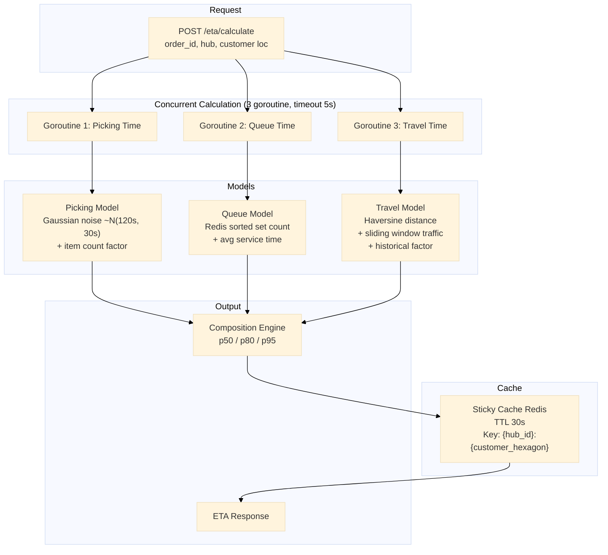

# Layanan Estimasi ETA

Layanan estimasi ETA dengan perhitungan konkuren multi-komponen (3 goroutine: picking+antrian+perjalanan, timeout 5s), model picking Gaussian-noise, perjalanan haversine dengan sliding window lalu lintas, cache ETA sticky (Redis 30s), dan komposisi p50/p80/p95.

Port **8097** | Paket `eta-service/`

---

## Arsitektur



## Komponen

### Perhitungan Konkuren Multi-Komponen

Tiga goroutine berjalan paralel dengan timeout 5 detik. Jika salah satu timeout, fallback ke nilai default.

```go
type ETAComponents struct {
    Picking time.Duration `json:"picking"`
    Queue   time.Duration `json:"queue"`
    Travel  time.Duration `json:"travel"`
}

func (s *Service) Calculate(ctx context.Context, req ETARequest) (*ETAResponse, error) {
    timeout := 5 * time.Second
    ctx, cancel := context.WithTimeout(ctx, timeout)
    defer cancel()

    var components ETAComponents
    var mu sync.Mutex
    var wg sync.WaitGroup

    wg.Add(3)

    go func() {
        defer wg.Done()
        pick, err := s.estimatePicking(ctx, req)
        if err == nil {
            mu.Lock()
            components.Picking = pick
            mu.Unlock()
        }
    }()

    go func() {
        defer wg.Done()
        queue, err := s.estimateQueue(ctx, req)
        if err == nil {
            mu.Lock()
            components.Queue = queue
            mu.Unlock()
        }
    }()

    go func() {
        defer wg.Done()
        travel, err := s.estimateTravel(ctx, req)
        if err == nil {
            mu.Lock()
            components.Travel = travel
            mu.Unlock()
        }
    }()

    wg.Wait()
    return s.compose(ctx, req, components), nil
}
```

### Model Picking dengan Gaussian Noise

Waktu picking diperkirakan dari rata-rata historis dengan noise Gaussian dan faktor jumlah item.

```go
func (s *Service) estimatePicking(ctx context.Context, req ETARequest) (time.Duration, error) {
    baseAvg := 120 * time.Second // rata-rata 2 menit
    baseStd := 30 * time.Second   // standar deviasi 30 detik

    // faktor jumlah item
    itemFactor := time.Duration(req.ItemCount) * 15 * time.Second

    // Gaussian noise menggunakan Box-Muller
    noise := gaussianNoise(float64(baseAvg), float64(baseStd))

    return baseAvg + itemFactor + time.Duration(noise), nil
}
```

### Model Perjalanan Haversine + Sliding Window Lalu Lintas

Waktu perjalanan dihitung dari jarak haversine, disesuaikan dengan faktor lalu lintas dari sliding window.

```go
type TrafficFactor struct {
    mu       sync.RWMutex
    window   map[string]*slidingEntry // key: hexagon_pair -> []speedFactor
    duration time.Duration
}

func (tf *TrafficFactor) GetFactor(fromLat, fromLng, toLat, toLng float64) float64 {
    dist := haversine(fromLat, fromLng, toLat, toLng)
    baseSpeed := 30.0 // km/jam (kecepatan rata-rata kota)
    traffic := tf.getTrafficMultiplier(fromLat, fromLng, toLat, toLng)
    etaHours := dist / (baseSpeed * traffic)
    return etaHours * 3600 // konversi ke detik
}
```

### Cache ETA Sticky (Redis 30s)

ETA di-cache berdasarkan hub + area pelanggan (heksagon H3) agar hasil tetap konsisten untuk pengguna yang sama dalam jendela 30 detik.

```go
func (s *Service) getCachedETA(ctx context.Context, hubID string, customerLat, customerLng float64) (*ETAResponse, error) {
    cell := h3.LatLngToCell(h3.LatLng{Lat: customerLat, Lng: customerLng}, 9)
    cacheKey := fmt.Sprintf("eta:%s:%s", hubID, cell.String())

    data, err := s.redis.Get(ctx, cacheKey).Bytes()
    if err == nil {
        var resp ETAResponse
        json.Unmarshal(data, &resp)
        return &resp, nil
    }

    // cache miss: hitung
    resp, err := s.calculateFresh(ctx, hubID, customerLat, customerLng)
    if err != nil {
        return nil, err
    }

    // simpan dengan TTL 30s
    cacheData, _ := json.Marshal(resp)
    s.redis.Set(ctx, cacheKey, cacheData, 30*time.Second)
    return resp, nil
}
```

### Komposisi p50/p80/p95

ETA dikembalikan dalam tiga persentil untuk fleksibilitas klien.

```go
type ETAComposition struct {
    P50 time.Duration `json:"p50"` // median
    P80 time.Duration `json:"p80"` // 80% pesanan selesai dalam waktu ini
    P95 time.Duration `json:"p95"` // 95% pesanan selesai dalam waktu ini
}

func compose(picking, queue, travel time.Duration) ETAComposition {
    total := float64(picking + queue + travel)
    // Model: distribusi normal dengan std = 20% dari mean
    std := total * 0.2

    return ETAComposition{
        P50: time.Duration(total),
        P80: time.Duration(total + 0.84*std),
        P95: time.Duration(total + 1.645*std),
    }
}
```

## API Endpoints

| Method | Path | Deskripsi |
|--------|------|-------------|
| `POST` | `/eta/calculate` | Hitung ETA untuk order baru |
| `GET` | `/eta/:order_id` | Dapatkan ETA yang sudah dihitung |

### POST /eta/calculate

```json
// Request
{
  "order_id": "ORD123",
  "hub_id": "H1",
  "customer_lat": -6.2146,
  "customer_lng": 106.8451,
  "item_count": 3
}

// Response 200
{
  "order_id": "ORD123",
  "eta": {
    "p50": 900,
    "p80": 1050,
    "p95": 1250
  },
  "components": {
    "picking_seconds": 150,
    "queue_seconds": 120,
    "travel_seconds": 630
  },
  "cached": false
}
```

### GET /eta/:order_id

```json
// Response 200
{
  "order_id": "ORD123",
  "eta": {
    "p50": 900,
    "p80": 1050,
    "p95": 1250
  },
  "cached": true
}
```

## Algoritma Kunci

| Algoritma | Penggunaan |
|-----------|------------|
| Concurrent goroutine | 3 goroutine paralel dengan timeout 5 detik |
| Gaussian noise (Box-Muller) | Variasi waktu picking yang realistis |
| Haversine distance | Jarak geodesik hub ke pelanggan |
| Sliding window traffic | Faktor lalu lintas dari data real-time |
| Sticky cache Redis | Cache ETA 30s per {hub}:{heksagon} |
| Persentil p50/p80/p95 | Komposisi distribusi ETA |

## Keputusan Teknis

- **3 goroutine konkuren, bukan sequential**: Perhitungan picking, antrean, dan perjalanan independen. Mengeksekusinya secara paralel memangkas latency total dari jumlah ketiga komponen menjadi maksimum dari ketiganya (biasanya < 2 detik vs. 5+ detik jika sequential).
- **Gaussian noise untuk model picking**: Waktu picking bervariasi secara alami karena faktor tak terduga (ukuran item, lokasi rak). Gaussian noise dengan mean dan std dari data historis memberikan estimasi yang lebih realistis daripada konstanta.
- **Sticky cache 30 detik**: Mencegah ETA berubah drastis antara halaman keranjang dan checkout. TTL 30 detik cukup untuk menjaga konsistensi UX tanpa data terlalu basi. Kunci cache adalah {hub_id}:{customer_hexagon}, bukan per-pengguna, sehingga semua pengguna di area yang sama mendapat ETA yang sama.
- **p50/p80/p95, bukan single value**: Memberi fleksibilitas pada UI untuk menampilkan ETA yang sesuai konteks. Halaman ringkasan bisa menampilkan p50, sementara halaman checkout yang lebih konservatif bisa menampilkan p80.
- **Timeout 5 detik per request**: Jika salah satu goroutine timeout (misalnya Redis down), komponen yang gagal menggunakan nilai default. Request tetap berhasil dengan estimasi yang kurang akurat, bukan gagal total. Ini penting untuk ketahanan layanan.
