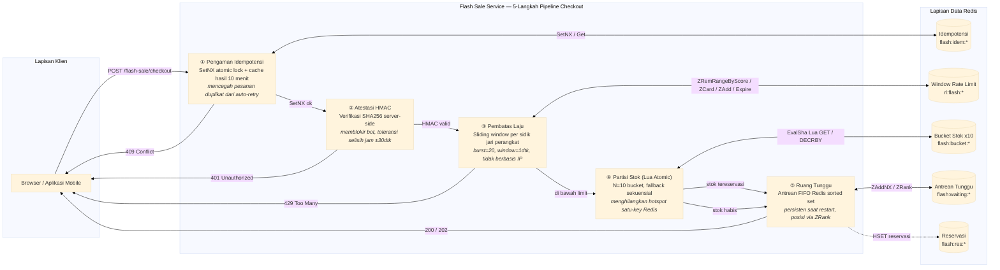

# Layanan Flash Sale

Mesin checkout flash sale throughput tinggi dengan pengurangan stok atomik Lua multi-bucket, token atestasi HMAC-SHA256, rate limiting sliding window per sidik jari perangkat, ruang tunggu berbasis Redis sorted set, pengaman idempotensi SetNX, dan siklus hidup reservasi dengan transaksi kompensasi release.

Port **8102** | Paket `flash-sale/` | 5 file: `types.go`, `store.go`, `service.go`, `handler.go`, `main.go`

## Arsitektur



Pipeline berjalan secara sekuensial: setiap langkah menjadi gerbang untuk langkah berikutnya. Kegagalan di langkah mana pun mengembalikan kode status HTTP spesifik (401, 429, 409) dengan respons error terstruktur. Tiga skrip Lua dimuat di Redis saat startup melalui `ScriptLoad`, yang mengembalikan hash SHA yang digunakan untuk panggilan `EvalSha`.

## Partisi Stok

### Masalah

Satu key Redis `flash:total:{product_id}` menjadi hotspot saat lalu lintas flash sale. Ketika 200 pengguna konkuren mencoba checkout, semuanya mengenai key yang sama. Ini menciptakan kontensi di server Redis dan membuat operasi yang seharusnya paralel menjadi serial. Desain satu key juga berarti satu skrip Lua harus memeriksa dan mengurangi seluruh inventaris dalam satu operasi atomik — benar, tetapi menciptakan bottleneck koordinasi.

### Solusi: Striping N-Bucket

Distribusikan total stok ke N key Redis independen (bucket). Setiap perangkat di-hash secara deterministik ke bucket utama. Skrip Lua pertama-tama mencoba bucket utama; jika habis, ia melakukan fallback ke N-1 bucket lainnya secara berurutan.

```
Total stok S → distribusikan ke N bucket
Bucket i mendapat base = S / N, tambah 1 jika i < (S % N)
FP perangkat → FNV-1a hash → indeks bucket utama
Lua: coba primary, lalu (primary+1) % N, ..., (primary+N-1) % N
```

### Struktur Data

| Pola Key | Tipe | Tujuan |
|----------|------|--------|
| `flash:total:{product_id}` | String (integer) | Penghitung stok global |
| `flash:bucket:{product_id}:{0..N-1}` | String (integer) | Penghitung stok per bucket |

### Inisialisasi Bucket

```go
func (s *Store) InitProduct(ctx context.Context, productID string, totalStock, bucketCount int) error {
    pipe := s.rdb.Pipeline()
    pipe.Set(ctx, keyTotal+productID, totalStock, 0)
    base := totalStock / bucketCount
    rem := totalStock % bucketCount
    for i := 0; i < bucketCount; i++ {
        q := base
        if i < rem {
            q++
        }
        pipe.Set(ctx, keyBucket+productID+":"+strconv.Itoa(i), q, 0)
    }
    _, err := pipe.Exec(ctx)
    return err
}
```

Untuk `totalStock = 100` dan `bucketCount = 10`, setiap bucket mendapat 10. Untuk `totalStock = 103`, 3 bucket pertama mendapat 11 dan 7 sisanya mendapat 10.

### Lua Pengurangan Bucket (Atomik)

```lua
-- KEYS[1]   = flash:total:{pid}
-- KEYS[2..] = flash:bucket:{pid}:{0..N-1}
-- ARGV[1]   = quantity
-- ARGV[2]   = N (jumlah bucket)
-- ARGV[3]   = indeks awal (bucket utama)
--
-- Returns: {idx, remaining} sukses
--          {-2, total} jika stok global tidak cukup
--          {-3, total} jika semua bucket habis (fragmentasi)

local total = tonumber(redis.call("GET", KEYS[1]) or "0")
if total >= tonumber(ARGV[1]) then return {-2, total} end

local N = tonumber(ARGV[2])
local start = tonumber(ARGV[3])

for i = 0, N - 1 do
    local idx = (start + i) % N
    local v = tonumber(redis.call("GET", KEYS[2 + idx]) or "0")
    if v >= tonumber(ARGV[1]) then
        redis.call("DECRBY", KEYS[2 + idx], ARGV[1])
        redis.call("DECRBY", KEYS[1], ARGV[1])
        return {idx, total - tonumber(ARGV[1])}
    end
end

return {-3, total}
```

Bucket utama ditentukan dari sidik jari perangkat:

```go
func hashFP(fp string) int {
    h := fnv.New32a()
    h.Write([]byte(fp))
    return int(h.Sum32())
}

// Di ReserveStock:
primary := hashFP(deviceFP) % numBuckets
```

### Kasus Pinggir

**Failover Redis NOSCRIPT.** Skrip Lua dimuat saat startup via `ScriptLoad`, dan semua panggilan berikutnya menggunakan `EvalSha`. Jika failover Redis mempromosikan replika yang belum pernah melihat skrip, `EvalSha` mengembalikan error NOSCRIPT. Mitigasi: ulangi dengan `Eval` (fallback ke skrip inline) atau muat ulang skrip saat koneksi tersambung kembali. Saat ini kode mengembalikan error ke pemanggil, yang menggagalkan checkout.

**Fragmentasi stok.** Bucket 0 mungkin kosong sementara bucket 5 masih memiliki stok. Fallback sekuensial menangani ini dengan mengiterasi semua N bucket mulai dari bucket utama. Kode kembali `-3` menandakan fragmentasi total (setiap bucket di bawah kuantitas yang diminta meskipun total global mungkin menunjukkan sebaliknya — kasus langka ketika semua bucket memiliki stok parsial tetapi tidak ada satu bucket pun yang cukup untuk kuantitas yang diminta).

**Time-out operasi.** Perintah pipeline Redis atau operasi individu dapat time-out di bawah beban ekstrem. Fungsi `ReserveStock` menyebarkan error; lapisan layanan mengembalikan respons error internal.

## Ruang Tunggu

### Masalah

Flash sale dapat menghasilkan 50.000 permintaan checkout dalam waktu kurang dari satu detik. Layanan hilir (payment gateway, inventaris, manajemen pesanan) tidak dapat menangani konkurensi ini. Pendekatan naif seperti antrean in-memory hilang saat deploy; respons "sold out" sederhana menghilangkan pendapatan ketika pembatalan membebaskan stok.

### Solusi: Antrean FIFO Redis Sorted Set

Pengguna yang gagal mendapatkan stok (semua bucket habis) dimasukkan ke dalam Redis sorted set yang dikunci berdasarkan produk. Timestamp masuk (Unix nanosecond) menjadi skor, memastikan urutan FIFO yang ketat. Sorted set bertahan saat restart layanan, bertahan dari failover Redis, dan menyediakan kueri posisi O(log N) melalui ZRank.

### Struktur Data

| Pola Key | Tipe | Tujuan |
|----------|------|--------|
| `flash:waiting:{product_id}` | Sorted Set | Antrean FIFO pengguna yang menunggu |
| Skor | UnixNano | Timestamp masuk (urutan ketat) |
| Member | ID Pengguna | Identifikasi pengguna unik |

### Algoritma

**Enqueue.** Saat stok habis, pengguna bergabung ke ruang tunggu. `ZAddNX` mencegah pengguna menambahkan diri mereka lagi dengan skor yang berbeda (serangan manipulasi skor):

```go
func (s *Store) JoinWaitingRoom(ctx context.Context, productID, userID string) (int, error) {
    key := keyWaiting + productID
    s.rdb.ZAddNX(ctx, key, redis.Z{Score: float64(time.Now().UnixNano()), Member: userID})
    pos, err := s.rdb.ZRank(ctx, key, userID).Result()
    if err != nil {
        return 0, err
    }
    return int(pos), nil
}
```

**Kueri posisi.** Mengembalikan posisi berbasis 0. Lapisan layanan mengonversi ke berbasis 1 untuk pengguna:

```go
func (s *Store) QueuePosition(ctx context.Context, productID, userID string) (int, error) {
    pos, err := s.rdb.ZRank(ctx, keyWaiting+productID, userID).Result()
    if err == redis.Nil {
        return -1, nil  // user tidak dalam antrean
    }
    return int(pos), err
}
```

**AdmitNext.** Saat stok tersedia (misalnya, reservasi dilepaskan), pengguna berikutnya dalam urutan FIFO diizinkan masuk:

```redis
ZPOPMIN flash:waiting:{product_id} 1
```

Implementasi saat ini tidak menyertakan goroutine penerimaan otomatis — penerimaan terjadi secara reaktif saat stok dilepaskan, atau pekerja latar terpisah melakukan polling antrean.

### Kasus Pinggir

**Kedaluwarsa token.** Entri ruang tunggu memiliki TTL 10 menit (`waitingRoomTTL`). Pengguna yang tetap dalam antrean melebihi periode ini akan dikeluarkan. Klien harus melakukan polling `queue-status` dan bergabung kembali jika posisi mengembalikan -1.

**Ketidakcocokan laju penerimaan.** Jika stok dilepaskan lebih cepat daripada pengguna yang dapat diterima (misalnya, 50 stok dirilis tetapi 5000 pengguna dalam antrean), laju penerimaan dibatasi oleh laju pelepasan. Goroutine latar belakang dengan ukuran batch dan interval yang dapat dikonfigurasi dapat menghaluskan ini.

**Pembersihan entri basi.** `ZAddNX` mencegah duplikat, tetapi tidak ada pembersihan aktif untuk pengguna yang telah meninggalkan tab browser. Kedaluwarsa berbasis TTL menangani ini secara pasif.

## Pembatas Laju

### Masalah

Pembatasan laju berbasis IP tidak efektif terhadap operasi bot yang memutar melalui ribuan proxy residensial. Setiap permintaan berasal dari IP yang berbeda, sehingga batas per-IP tidak pernah terlampaui. Penyerang dapat meledakkan 10.000 upaya checkout dalam hitungan detik.

### Solusi: Sliding Window per Sidik Jari Perangkat

Ikat batas laju ke sidik jari perangkat (`device_fp`), bukan alamat jaringan. Setiap perangkat mendapat 20 upaya checkout per jendela geser 1 detik. Rotasi proxy tidak relevan — batas mengikuti identitas perangkat, bukan IP.

### Struktur Data

| Pola Key | Tipe | Tujuan |
|----------|------|--------|
| `rl:flash:{device_fp}` | Sorted Set | Jendela geser timestamp permintaan |
| Skor | UnixMilli | Timestamp permintaan dalam milidetik |
| Member | Akhiran acak | Unik per permintaan (mencegah dedup ZAdd) |
| TTL | 10 detik | Pembersihan otomatis saat jendela tidak aktif |

### Algoritma (Lua Atomic)

```lua
-- KEYS[1] = rl:flash:{device_fp}
-- ARGV[1] = windowStart (now - window)
-- ARGV[2] = now
-- ARGV[3] = batas burst
-- ARGV[4] = akhiran member unik

redis.call("ZREMRANGEBYSCORE", KEYS[1], 0, tonumber(ARGV[1]))
if redis.call("ZCARD", KEYS[1]) >= tonumber(ARGV[3]) then return 0 end
redis.call("ZADD", KEYS[1], ARGV[2], ARGV[4])
redis.call("EXPIRE", KEYS[1], 10)
return 1
```

Langkah:
1. Hapus semua entri yang lebih lama dari batas jendela (ZRemRangeByScore).
2. Periksa jumlah yang tersisa terhadap batas burst (ZCard).
3. Jika di bawah batas, tambahkan permintaan saat ini dan atur TTL.
4. Kembalikan 0 (diblokir) atau 1 (diizinkan).

### Implementasi Go

```go
func (s *Store) CheckRateLimit(ctx context.Context, deviceFP string) (bool, error) {
    now := time.Now().UnixMilli()
    windowStart := now - defaultRateLimitWindow.Milliseconds()
    suffix := strconv.FormatInt(time.Now().UnixNano(), 36)
    res, err := s.rdb.EvalSha(ctx, s.rlSHA, []string{keyRL + deviceFP}, windowStart, now, defaultRateLimitBurst, suffix).Result()
    if err != nil {
        return false, err
    }
    return res.(int64) == 1, nil
}
```

### Rantai Ekstraksi Sidik Jari

Sidik jari perangkat dikirimkan oleh klien dalam body request checkout (field `device_fp`), bukan diekstraksi dari header HTTP. Konsekuensi desain ini:

1. **Tidak ada fallback server-side** — sidik jari harus berasal dari klien. Jika klien menghilangkannya, permintaan ditolak dengan error validasi 400 (`binding:"required"` di Gin).
2. **Sidik jari buatan klien** — biasanya berasal dari identifier hardware, canvas fingerprint, atau UUID yang disimpan di local storage. Server memperlakukannya sebagai string opak.
3. **Bypass rate limit via rotasi sidik jari** — penyerang canggih dapat memutar sidik jari perangkat pada setiap permintaan. Mitigasi: aplikasi harus menerapkan pembatasan laju tambahan per token sesi atau ID pengguna di lapisan yang lebih tinggi.

### Kebijakan Fail-Open

Pembatas laju bersifat **fail-closed**: jika skrip Lua mengembalikan error (Redis down, timeout, NOSCRIPT), layanan memperlakukan sebagai kena rate limit:

```go
allowed, err := s.store.CheckRateLimit(ctx, req.DeviceFP)
if err != nil || !allowed {
    resp := &CheckoutResponse{Status: StatusRateLimited}
    // ...
}
```

Ini disengaja: untuk flash sale, secara tidak sengaja mengizinkan serangan bot (fail-open saat Redis down) lebih buruk daripada memblokir pengguna sah sementara selama gangguan Redis.

## Atestasi HMAC

### Masalah

Bot dan penyerang skrip dapat melewati pembatas laju dengan memutar sidik jari perangkat. Mereka juga dapat mencoba reverse-engineer API checkout dan mengirim permintaan buatan langsung. Tanpa mekanisme atestasi kriptografis, tidak ada cara untuk membedakan permintaan dari klien sah vs. skrip otomatis.

### Solusi: Penandatanganan HMAC Server-Side

Server menerbitkan token HMAC-SHA256 berumur pendek yang terikat ke sidik jari perangkat tertentu. Rahasia penandatanganan hanya ada di server — tidak pernah tertanam di biner klien, tidak pernah dikirim melalui kabel, dan tidak pernah dicatat. Mendekompilasi APK atau IPA tidak menghasilkan apa-apa.

### Format Token

```
Token = HMAC-SHA256(secret, deviceFP + ":" + expiresAt)

Di mana:
  secret    = 32+ byte acak, dikonfigurasi via env var HMAC_SECRET
  deviceFP  = identifier perangkat dari klien (opak)
  expiresAt = timestamp Unix, 30 detik dari penerbitan
```

### Penerbitan Token

```go
func (s *Store) GenerateToken(deviceFP string) (string, int64) {
    expiresAt := time.Now().Unix() + 30
    mac := hmac.New(sha256.New, s.secret)
    mac.Write([]byte(deviceFP + ":" + strconv.FormatInt(expiresAt, 10)))
    return hex.EncodeToString(mac.Sum(nil)), expiresAt
}
```

Token di-encode dalam heksadesimal (bukan base64). `expires_at` dikembalikan bersama token sehingga klien dapat menyertakannya dalam permintaan checkout.

### Verifikasi

```go
func (s *Store) VerifyAttestation(deviceFP string, expiresAt int64, token string) bool {
    now := time.Now().Unix()
    // Toleransi selisih jam: ±30 detik
    if d := now - expiresAt; d > 30 || d < -30 {
        return false
    }
    // Perbandingan HMAC waktu-konstan (mencegah timing attack)
    mac := hmac.New(sha256.New, s.secret)
    mac.Write([]byte(deviceFP + ":" + strconv.FormatInt(expiresAt, 10)))
    expected := hex.EncodeToString(mac.Sum(nil))
    return hmac.Equal([]byte(expected), []byte(token))
}
```

**Pemeriksaan verifikasi:**
1. **Pengaman selisih jam.** Menolak token dengan kedaluwarsa lebih dari 30 detik di masa lalu atau masa depan. Ini mentolerir penyimpangan NTP antara klien dan server tanpa memperlebar jendela replay.
2. **Rekomputasi HMAC.** Menghitung ulang HMAC yang diharapkan dari rahasia server dan membandingkan dengan `hmac.Equal` (waktu-konstan, kebal terhadap serangan sisi saluran timing).

### Model Ancaman

| Serangan | Mitigasi |
|----------|----------|
| Pemalsuan token | Rahasia HMAC tidak pernah meninggalkan server |
| Serangan replay | Jendela kedaluwarsa 30 detik, toleransi selisih ±30dtk |
| Dekompilasi klien | Rahasia tidak ada di biner — reverse engineering APK/IPA tidak menghasilkan rahasia |
| Sniffing jaringan | Token melalui HTTPS; kedaluwarsa membatasi kegunaan token yang ditangkap |
| Manipulasi jam | Waktu server-side, bukan waktu klien |

## Pengaman Idempotensi

### Masalah

SDK mobile (OkHttp, URLSession) secara otomatis mengulangi permintaan saat kegagalan jaringan. Ketika koneksi 4G pengguna terputus saat checkout dan mencoba ulang di WiFi, server menerima dua permintaan POST yang identik. Tanpa idempotensi, ini menciptakan pesanan duplikat dan tagihan ganda.

### Solusi: Kunci Atomik SetNX + Hasil Cache

Setiap permintaan checkout memerlukan `idempotency_key`. Server menggunakan Redis `SetNX` sebagai kunci atomik:

1. Permintaan pertama: `SetNX` berhasil (mengembalikan true). Pipeline dieksekusi normal. Hasil di-cache selama 10 menit.
2. Permintaan duplikat: `SetNX` gagal (mengembalikan false). Server mengembalikan HTTP 409 Conflict dengan hasil cache dari permintaan pertama.

```go
func (s *Store) CheckIdempotency(ctx context.Context, key string) (bool, string, error) {
    ok, err := s.rdb.SetNX(ctx, keyIdem+key, "locked", 30*time.Second).Result()
    if err != nil {
        return false, "", err
    }
    if !ok {
        result, _ := s.rdb.Get(ctx, keyIdem+key+":result").Result()
        return true, result, nil  // konflik: kembalikan hasil cache
    }
    return false, "", nil  // tidak ada konflik: lanjutkan
}

func (s *Store) CacheIdempotencyResult(ctx context.Context, key, result string) {
    s.rdb.Set(ctx, keyIdem+key+":result", result, 10*time.Minute)
}
```

### Desain Kunci

| Aspek | Nilai | Alasan |
|-------|-------|--------|
| TTL kunci | 30 detik | Mencakup seluruh pipeline checkout termasuk panggilan eksternal |
| TTL cache hasil | 10 menit | Cukup lama untuk jendela retry mobile (biasanya 3-30dtk), cukup pendek untuk tidak membocorkan data basi |
| Prefiks key | `flash:idem:` | Isolasi namespace |
| Nilai kunci | `"locked"` | Sentinel opak; hasil aktual disimpan di key terpisah |

Hasil cache mencakup respons checkout lengkap (order ID, reservation ID, status). Pemanggil duplikat menerima respons yang persis sama dengan pemanggil pertama, memungkinkan penanganan idempotensi klien yang andal.

## Siklus Hidup Reservasi

Setiap reservasi stok yang berhasil membuat catatan reservasi di Redis dengan hash terstruktur. Reservasi bertransisi melalui siklus hidup keadaan.

### Status

```
                     ┌──────────┐
                     │ RESERVED │
                     └────┬─────┘
                          │
              ┌───────────┼───────────┐
              │           │           │
              ▼           ▼           ▼
        ┌──────────┐ ┌──────────┐ ┌──────────┐
        │CONFIRMED │ │ RELEASED │ │ EXPIRED  │
        └──────────┘ └──────────┘ └──────────┘
```

- **RESERVED** — Stok ditahan untuk pengguna. TTL: 5 menit.
- **CONFIRMED** — Pembayaran berhasil. Status akhir.
- **RELEASED** — Pembayaran gagal atau pengguna membatalkan. Stok dikembalikan ke bucket.
- **EXPIRED** — TTL berlalu tanpa konfirmasi atau rilis. Stok dilepaskan secara otomatis oleh pengusiran key Redis.

### Struktur Data

```go
// Key: flash:res:{reservation_id}
// Tipe: Hash
// Field:
//   id          — ID reservasi (RES-{hex acak})
//   product_id  — produk yang direservasi
//   user_id     — pengguna yang mereservasi
//   quantity    — kuantitas yang direservasi
//   bucket_idx  — bucket mana yang dikurangi
//   status      — "reserved" | "released" | "confirmed"
//   created_at  — timestamp UnixMilli
//   expires_at  — created_at + 5menit

func (s *Store) CreateReservation(ctx context.Context, productID, reservationID, userID, deviceFP string, qty, bucketIdx int) error {
    key := keyReservation + reservationID
    now := time.Now().UnixMilli()
    expiresAt := now + int64(reservationTTL.Seconds())*1000
    return s.rdb.HSet(ctx, key,
        "id", reservationID, "product_id", productID, "user_id", userID,
        "quantity", qty, "bucket_idx", bucketIdx, "status", "reserved",
        "created_at", now, "expires_at", expiresAt,
    ).Err()
}
```

### Release (Transaksi Kompensasi)

Ketika pembayaran gagal atau pengguna membatalkan, `POST /flash-sale/release` memicu transaksi kompensasi. Skrip Lua release secara atomik:

1. Mengambil hash reservasi.
2. Memeriksa status saat ini (already released/confirmed = idempoten, lewati).
3. Memperbarui status menjadi "released".
4. Menambahkan kembali stok ke bucket dan total stok.

```lua
-- KEYS[1] = flash:res:{reservation_id}
-- ARGV[1] = released_at (UnixMilli)

local r = redis.call("HGETALL", KEYS[1])
if #r == 0 then return -1 end  -- tidak ditemukan

local status, qty, bidx, pid = "", 0, 0, ""
for i = 1, #r, 2 do
    if r[i] == "status" then status = r[i+1]
    elseif r[i] == "quantity" then qty = tonumber(r[i+1])
    elseif r[i] == "bucket_idx" then bidx = r[i+1]
    elseif r[i] == "product_id" then pid = r[i+1]
    end
end

if status == "released" or status == "confirmed" then return 1 end

redis.call("HSET", KEYS[1], "status", "released", "released_at", ARGV[1])
redis.call("INCRBY", "flash:bucket:" .. pid .. ":" .. bidx, qty)
redis.call("INCRBY", "flash:total:" .. pid, qty)
return 1
```

### Idempotensi Release

Memanggil release dua kali pada reservasi yang sama aman. Panggilan kedua melihat `status == "released"` dan kembali segera. Ini melindungi terhadap percobaan ulang payment gateway yang memicu beberapa panggilan release.

## API Endpoints

| Method | Path | Deskripsi | Autentikasi |
|--------|------|-----------|-------------|
| `POST` | `/flash-sale/checkout` | Pipeline checkout 5 langkah lengkap | Token HMAC |
| `POST` | `/flash-sale/release` | Kompensasi checkout gagal, kembalikan stok atomik | — |
| `GET` | `/flash-sale/queue-status` | Polling posisi ruang tunggu via ZRank | — |
| `GET` | `/flash-sale/token` | Terbitkan token atestasi HMAC-SHA256 | — |
| `POST` | `/admin/flash-sale/init-product` | Inisialisasi stok produk dengan N bucket | Internal |
| `GET` | `/admin/flash-sale/stock` | Periksa sisa stok untuk suatu produk | Internal |

### POST /flash-sale/checkout

```json
// Request
{
  "product_id": "flash-indomie-2026",
  "user_id": "user-abc",
  "device_fp": "fp-budi-iphone",
  "attestation": "a1b2c3d4e5f6...",
  "expires_at": 1750600000,
  "quantity": 1,
  "idempotency_key": "550e8400-e29b-41d4-a716-446655440000"
}

// 200 — dikonfirmasi
{"data": {"order_id": "ord_flash_99", "reservation_id": "RES_a1b2c3", "status": "completed"}}

// 202 — dalam antrean (stok habis)
{"data": {"position": 42, "status": "queued"}}

// 401 — atestasi tidak valid
{"data": {"status": "invalid_attestation"}}

// 429 — kena rate limit
{"data": {"status": "rate_limited"}}

// 409 — duplikat (idempotency_key sama)
{"data": {"order_id": "ord_flash_99", "reservation_id": "RES_a1b2c3", "status": "idempotency_conflict"}}
```

### POST /flash-sale/release

```json
// Request
{"reservation_id": "RES_a1b2c3"}

// 200 — dirilis
{"data": {"released": true}}

// 400 — tidak ditemukan
{"error": "not found"}
```

### GET /flash-sale/queue-status

```json
// Request
GET /flash-sale/queue-status?product_id=flash-indomie-2026&user_id=user-abc

// 200 — dalam antrean
{"data": {"position": 15, "status": "queued", "product_id": "flash-indomie-2026", "user_id": "user-abc"}}

// 200 — tidak dalam antrean / habis
{"data": {"position": 0, "status": "sold_out", "product_id": "flash-indomie-2026", "user_id": "user-abc"}}
```

### GET /flash-sale/token

```json
// Request
GET /flash-sale/token?device_fp=fp-budi-iphone

// 200
{"data": {"token": "a1b2c3d4e5f6...", "expires_in": 30}}

// 400
{"error": "device_fp required"}
```

### POST /admin/flash-sale/init-product

```json
// Request
{"product_id": "flash-indomie-2026", "total_stock": 100, "bucket_count": 10}

// 200
{"data": {"ok": true}}
```

### GET /admin/flash-sale/stock

```json
// Request
GET /admin/flash-sale/stock?product_id=flash-indomie-2026

// 200
{"data": {"product_id": "flash-indomie-2026", "remaining": 74}}
```

## Uji Skenario — Validasi Desain

Rangkaian pengujian `flash_sale_scenario_test.go` berisi 11 pengujian integrasi terhadap instance Redis nyata. Setiap pengujian memvalidasi jaring pengaman spesifik dan mendokumentasikan konsekuensi ketiadaannya.

| # | Skenario | Masalah yang Diselesaikan | Tanpa Desain Ini |
|---|----------|--------------------------|------------------|
| 1 | Happy path checkout | Pipeline penuh memvalidasi setiap langkah atomik | Stok hilang saat gagal di tengah, tanpa jalur pemulihan |
| 2 | Double-tap karena panik | SetNX idempotensi mencegah pesanan duplikat | Auto-retry membuat 2 pesanan, tagihan dobel |
| 3 | 200 user berebut 100 stok | Lua atomik cek+kurang dalam satu operasi | Race condition memungkinkan oversell 300% (insiden nyata: 12K pembatalan) |
| 4 | Bot token palsu + 30 spam | Atestasi HMAC (401) + rate limit burst=20 (429) | Bot boros stok dalam <1dtk via 1000 proxy, tanpa pertahanan |
| 5 | User ke-101 masuk ruang tunggu | Sorted set persisten, ZRank untuk posisi real-time | Antrean in-memory hilang saat deploy; user lihat "sold out" padahal stok bisa kembali |
| 6 | Timeout payment gateway 15s | POST /release kembalikan stok atomik, idempoten | Stok terkunci selamanya — ghost stock permanen, hilang pendapatan |
| 7 | Token 31s lewat expiry | ±30s toleransi jam, verifikasi HMAC server-side | 0s toleransi tolak user dengan selisih jam 5s; toleransi tak terbatas memungkinkan replay |
| 8 | Endpoint penerbitan token | Secret HMAC hanya di server, tidak pernah di binary | Secret di APK/IPA — didekompilasi → bot buat token valid |
| 9 | 25 request dari perangkat sama | Sliding window per device_fp, burst=20 | Limit IP: 1000 proxy → 5000 request efektif, bypass total |
| 10 | Handoff mobile (4G→WiFi), OkHttp retry | Idempotency_key sama → 409 + hasil cache | Server lihat POST identik → 2 pesanan, 2 tagihan |
| 11 | Dua perangkat, bucket berbeda | Bucket fallback cegah false sold-out saat bucket utama kosong | Hotspot satu-key + fragmentasi → negatif palsu |

## Keputusan Teknis

| # | Keputusan | Alasan |
|---|-----------|--------|
| 1 | **Pengurangan stok atomik Lua N-bucket** | Operasi Redis tunggal eliminasi jendela race GET → check → DECRBY yang menyebabkan insiden oversell 300% di 2024. N=10 bucket mendistribusikan kontensi ke beberapa key. Fallback sekuensial menangani kehabisan bucket individu tanpa kunci global atau protokol konsensus. |
| 2 | **Pembatas laju per sidik jari perangkat (bukan IP)** | Ikat batas laju ke identitas perangkat, bukan alamat jaringan. Bot farm dengan 1000 proxy residensial tidak bisa bypass karena setiap proxy mengganti IP tetapi bukan sidik jari perangkat. Burst=20 per jendela 1dtk memberi ruang bagi pengguna sah sambil membatasi penyalahgunaan otomatis. Fail-closed pada error Redis (lebih aman memblokir daripada mengizinkan). |
| 3 | **Atestasi HMAC (verifikasi lokal)** | Secret hanya di server — tidak bisa bocor dari biner klien; mendekompilasi APK tidak menghasilkan apa-apa. Toleransi selisih jam ±30dtk menangani penyimpangan jam dunia nyata tanpa memperlebar jendela replay. `hmac.Equal` waktu-konstan mencegah serangan sisi saluran timing. |
| 4 | **Ruang tunggu Redis sorted set** | Antrean persisten bertahan dari restart layanan dan failover Redis. ZRank menyediakan kueri posisi O(log N) real-time. ZAddNX mencegah manipulasi skor (pengguna menambahkan diri dengan timestamp rendah palsu). TTL 10 menit membatasi penggunaan memori. |
| 5 | **Pengaman idempotensi SetNX dengan cache hasil** | Kunci+cache atomik mencegah pesanan duplikat dari auto-retry mobile. Kunci 30 detik mencakup seluruh pipeline checkout termasuk panggilan eksternal. Cache hasil 10 menit di key terpisah memastikan respons yang sama persis tanpa mengeksekusi ulang pipeline. |
| 6 | **Siklus hidup reservasi dengan release kompensasi** | Setiap reservasi stok sukses membuat hash terstruktur (produk, kuantitas, indeks bucket, status, timestamp). Skrip Lua release secara atomik mengembalikan stok ke bucket yang benar — tidak ada inventaris yatim. Release bersifat idempoten: memanggilnya dua kali pada reservasi yang sama aman. |
| 7 | **Hash FNV-1a untuk penugasan bucket** | Cepat (dipercepat perangkat keras pada CPU modern), deterministik, dan menghasilkan distribusi seragam. Hash secara deterministik memetakan sidik jari perangkat yang sama ke bucket utama yang sama, mempertahankan lokalitas untuk pengguna yang mencoba ulang. Hash kriptografis (SHA256) akan berlebihan — ini distribusi, bukan keamanan. |

## Source Code

[View on GitHub](https://github.com/faisalaffan/faisalaffan-design-system/blob/dev/services/flash-sale/main.go)
