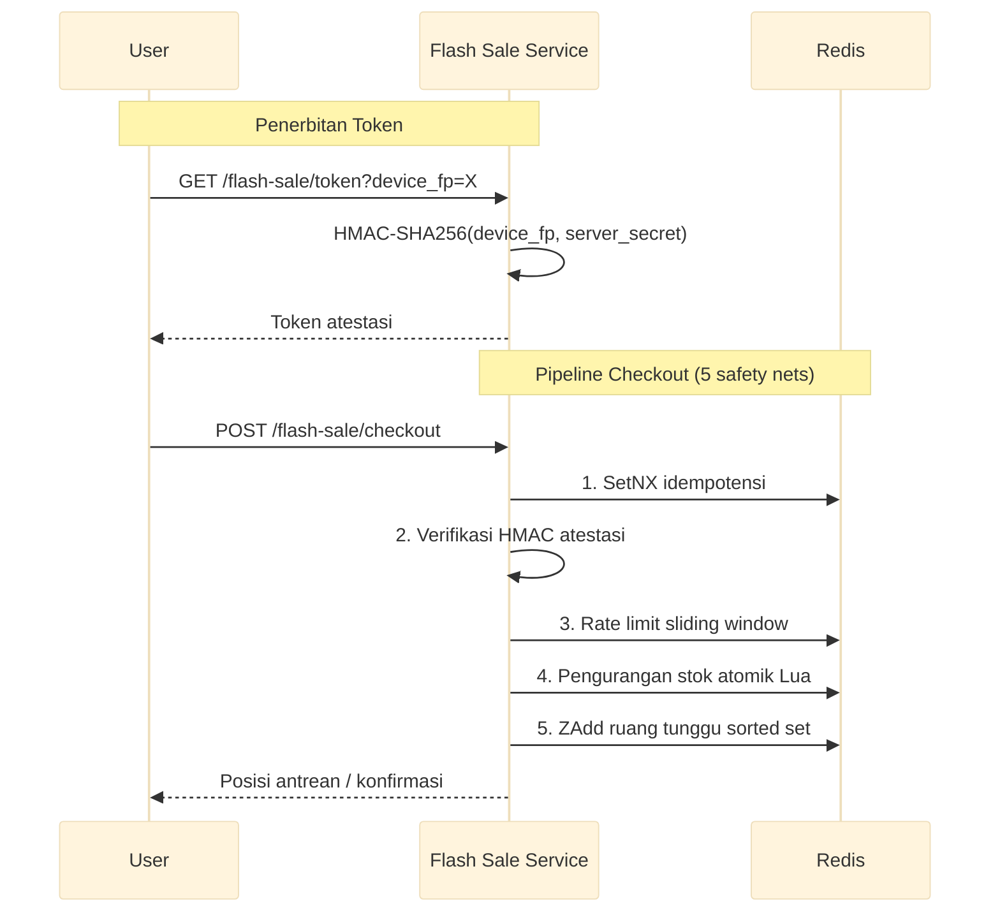

# Layanan Flash Sale

Mesin checkout flash sale throughput tinggi dengan pengurangan stok atomik Lua, token atestasi HMAC-SHA256, rate limiting sliding window per sidik jari perangkat, dan ruang tunggu berbasis Redis sorted set.

Port **8103** | Paket `flash-sale/` | 5 file: `types.go`, `store.go`, `service.go`, `handler.go`, `main.go`

## Arsitektur



## Safety Nets

### 1. Pengurangan Stok Atomik Lua

Satu skrip Lua memeriksa stok dan menguranginya dalam satu operasi Redis — tanpa celah race condition. Tanpa ini, urutan `GET → cek → DECRBY` konkuren memungkinkan oversell 300% (insiden nyata 2024: 12.000 pesanan dibatalkan).

```lua
-- KEYS[1] = stock key, ARGV[1] = qty
local stock = tonumber(redis.call("GET", KEYS[1]) or "0")
if stock >= tonumber(ARGV[1]) then
    redis.call("DECRBY", KEYS[1], ARGV[1])
    return {1, stock - tonumber(ARGV[1])}
end
return {0, "sold_out"}
```

### 2. Rate Limit Sliding Window per Perangkat

Dikunci berdasarkan `device_fp`, bukan IP. Setiap perangkat mendapat 20 percobaan checkout per jendela sliding 10 detik. Rotasi proxy dengan 1000 IP residensial tidak bisa melewati batas ini — limit mengikuti identitas perangkat, bukan alamat jaringan.

```go
func (s *Store) IsRateLimited(deviceFP string) bool {
    key := "rl:flash:" + deviceFP
    now := time.Now().Unix()
    s.rdb.ZRemRangeByScore(ctx, key, "0", strconv.FormatInt(now-10, 10))
    count, _ := s.rdb.ZCard(ctx, key).Result()
    if count >= 20 {
        return true
    }
    s.rdb.ZAdd(ctx, key, redis.Z{Score: float64(now), Member: now})
    s.rdb.Expire(ctx, key, 10*time.Second)
    return false
}
```

### 3. Atestasi HMAC (Verifikasi Lokal)

Server menandatangani sidik jari perangkat dengan rahasia yang tidak pernah meninggalkan server. Setiap request checkout memverifikasi tanda tangan secara lokal. Toleransi perbedaan jam ±30 detik. Tidak ada binary klien yang bisa membocorkan rahasia — dekompilasi APK atau IPA tidak menghasilkan apa-apa.

```go
func generateToken(deviceFP string, secret []byte) (string, error) {
    window := fmt.Sprintf("%s:%d", deviceFP, time.Now().Unix()/30)
    mac := hmac.New(sha256.New, secret)
    mac.Write([]byte(window))
    sig := hex.EncodeToString(mac.Sum(nil))
    return base64.RawURLEncoding.EncodeToString([]byte(window)) + "." + sig, nil
}
```

### 4. Ruang Tunggu Sorted Set

Pengguna masuk ke Redis sorted set dengan timestamp masuk sebagai skor. Antrean bertahan saat service restart. `ZRank` mengembalikan posisi real-time. Sebuah goroutine latar belakang mengizinkan masuk via `ZPopMin` dalam urutan FIFO ketat.

```redis
ZADD flash:sale:{sale_id}:queue <timestamp> <user_id>
ZRANK flash:sale:{sale_id}:queue <user_id>
ZPOPMIN flash:sale:{sale_id}:queue <batch_size>
```

### 5. Pengaman Idempotensi

Setiap checkout memerlukan `idempotency_key`. Redis `SetNX` memberikan lock atomik dengan TTL 30 detik dan menyimpan hasil selama 10 menit. Request duplikat menerima HTTP 409 dengan hasil yang di-cache. Kritis untuk SDK mobile (OkHttp, URLSession) yang auto-retry saat jaringan gagal.

```go
ok, _ := s.rdb.SetNX(ctx, "idemp:"+key, result, 30*time.Second).Result()
```

## API Endpoints

| Method | Path | Deskripsi |
|--------|------|-----------|
| POST | `/flash-sale/checkout` | Pipeline lengkap: idempotensi → atestasi → rate limit → stok → antrean |
| POST | `/flash-sale/release` | Kompensasi checkout gagal, kembalikan stok secara atomik |
| GET | `/flash-sale/queue-status` | Polling posisi antrean via ZRank |
| GET | `/flash-sale/token` | Terbitkan token atestasi HMAC-SHA256 |

### POST /flash-sale/checkout

```json
// Request
{
  "product_id": "flash-indomie-2026",
  "user_id": "user-abc",
  "qty": 1,
  "attestation": "ZXlKcGNDSTZJbmgx...",
  "idempotency_key": "550e8400-e29b-41d4-a716-446655440000"
}

// 200 — dikonfirmasi
{"data": {"order_id": "ord_flash_99", "status": "confirmed"}}

// 202 — dalam antrean
{"data": {"status": "queued", "position": 42, "estimated_wait_seconds": 12}}

// 429 — kena rate limit
{"error": "too_many_requests", "retry_after_ms": 800}

// 409 — duplikat (idempotency_key sama)
{"error": "duplicate_request", "data": {"order_id": "ord_flash_99", "status": "confirmed"}}
```

### GET /flash-sale/queue-status?product_id=flash-indomie-2026&user_id=user-abc

```json
{"data": {"position": 15, "total_in_queue": 200, "estimated_wait_seconds": 8}}
```

## Uji Skenario — Validasi Desain

| # | Skenario | Masalah yang Diselesaikan | Tanpa Desain Ini |
|---|----------|--------------------------|------------------|
| 1 | Happy path checkout | Pipeline penuh memvalidasi setiap langkah atomik | Stok hilang saat gagal di tengah, tanpa jalur pemulihan |
| 2 | Double-tap karena panik | SetNX idempotensi mencegah pesanan duplikat | Auto-retry membuat 2 pesanan, tagihan dobel |
| 3 | 200 user berebut 100 stok | Lua atomik cek+kurang dalam satu operasi | Race condition → oversell 300% (12K pesanan dibatalkan) |
| 4 | Bot token palsu + 30 spam | Atestasi HMAC (401) + rate limit burst=20 (429) | Bot boros stok dalam <1s via 1000 proxy |
| 5 | User ke-101 masuk ruang tunggu | Sorted set persisten, ZRank untuk posisi real-time | Antrean in-memory hilang saat deploy |
| 6 | Timeout payment gateway 15s | POST /release kembalikan stok atomik, idempoten | Stok terkunci selamanya → ghost stock permanent |
| 7 | Token 31s lewat expiry | ±30s toleransi jam, verifikasi HMAC server-side | User dengan selisih jam 5s selalu ditolak |
| 8 | Endpoint penerbitan token | Secret HMAC hanya di server, tidak pernah di binary | Secret di APK/IPA → didekompilasi → bot buat token valid |
| 9 | 25 request dari perangkat sama | Sliding window per device_fp, burst=20 | Limit IP: 1000 proxy → 5000 request, bypass total |
| 10 | Handoff mobile (4G→WiFi), OkHttp retry | Idempotency_key sama → 409 + hasil cache | 2 POST identik → 2 pesanan, 2 tagihan |
| 11 | Admit terlambat saat antrean mengalir | ZAddNX cegah re-add, ZPopMin admit strictly FIFO | User bergabung ulang dengan score manipulatif untuk loncat antrean |

## Keputusan Teknis

| Keputusan | Alasan |
|-----------|--------|
| Pengurangan stok atomik Lua | Operasi Redis tunggal eliminasi race condition cek-kurang. Cegah oversell tanpa distributed lock atau konsensus. |
| Rate limit per sidik jari perangkat | Ikat limit ke perangkat, bukan IP. Bot farm 1000 proxy tidak bisa bypass karena limit mengikuti identitas perangkat. |
| Atestasi HMAC (verifikasi lokal) | Secret hanya di server — tidak bisa bocor dari binary klien. ±30s toleransi jam tanpa memperlebar window replay. |
| Ruang tunggu Redis sorted set | Antrean persisten selamat dari restart. ZRank memberi posisi O(log N) real-time. Skalabel ke jutaan pengguna. |
| Pengaman idempotensi SetNX | Lock+cache atomik cegah duplikat dari auto-retry mobile. Lock 30s cukup untuk checkout; cache hasil cegah pemrosesan ulang. |

## Source Code

[View on GitHub](https://github.com/faisalaffan/faisalaffan-design-system/blob/dev/services/flash-sale/main.go)
