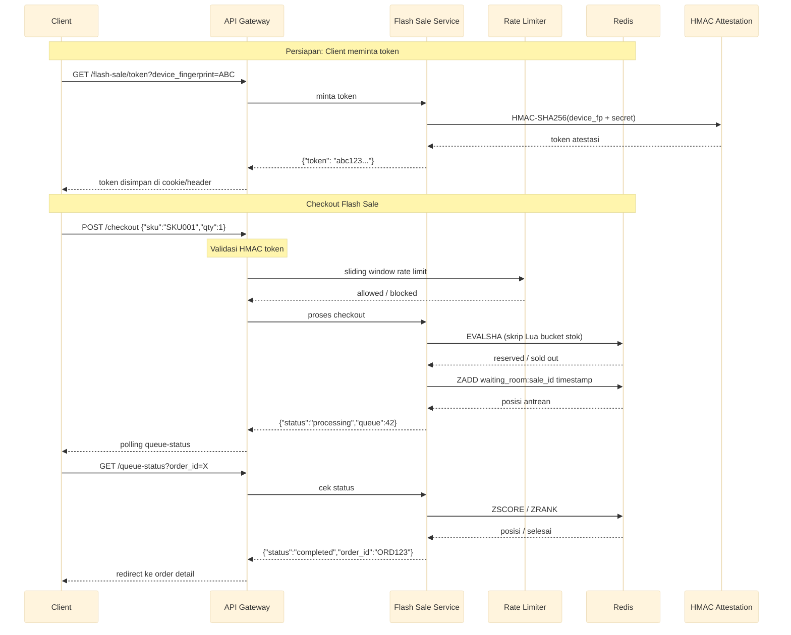

# Layanan Flash Sale

Layanan flash sale dengan bucket stok Redis Lua (N=10), ruang tunggu berbasis sorted set, rate limit sliding window per sidik jari perangkat, dan token atestasi HMAC-SHA256 untuk mencegah pembelian bot.

Port **8093** | Paket `flash-sale/`

---

## Arsitektur



## Komponen

### Bucket Stok Redis Lua

Stok flash sale dipartisi ke N bucket Redis untuk mengurangi kontensi. Skrip Lua menangani reservasi atomik.

```lua
-- flash_sale_reserve.lua
local bucket_count = tonumber(ARGV[1])   -- total bucket (N)
local qty          = tonumber(ARGV[2])   -- quantity diminta
local sale_id      = KEYS[1]             -- "flash_sale:{sale_id}"
local bucket_key   = KEYS[2]             -- "flash_sale:{sale_id}:bucket:{n}"

-- coba bucket demi bucket
for i = 0, bucket_count - 1 do
    local bk = bucket_key .. i
    local stock = redis.call("GET", bk)
    if stock and tonumber(stock) >= qty then
        redis.call("DECRBY", bk, qty)
        return {1, "reserved", i}
    end
end
return {0, "sold out", -1}
```

### Ruang Tunggu (Waiting Room) dengan Sorted Set

Setiap pengguna yang berhasil reservasi masuk ke antrean pemrosesan via Redis sorted set dengan timestamp sebagai skor.

```go
func enqueue(ctx context.Context, saleID, userID string) (int64, error) {
    now := time.Now().UnixMicro()
    key := fmt.Sprintf("waiting_room:%s", saleID)
    rank, err := redis.ZAdd(ctx, key, &redis.Z{
        Score:  float64(now),
        Member: userID,
    }).Result()
    if err != nil {
        return 0, err
    }
    // rank = 1-based position in queue
    position, _ := redis.ZRank(ctx, key, userID).Result()
    return position + 1, nil
}
```

### Rate Limit Sliding Window per Sidik Jari Perangkat

Rate limiting berbasis sliding window log dengan granularitas per `device_fingerprint`.

```go
func rateLimitCheck(ctx context.Context, fingerprint string) bool {
    now := time.Now().UnixMilli()
    window := int64(1000) // 1 detik
    limit := 3           // maks 3 request per detik

    key := fmt.Sprintf("rl:flash:%s", fingerprint)
    // hapus entri di luar window
    redis.ZRemRangeByScore(ctx, key, "0", strconv.FormatInt(now-window, 10))
    count, _ := redis.ZCard(ctx, key).Result()
    if count >= limit {
        return false
    }
    redis.ZAdd(ctx, key, &redis.Z{Score: float64(now), Member: strconv.FormatInt(now, 10)})
    redis.Expire(ctx, key, 2*time.Second)
    return true
}
```

### Atestasi HMAC-SHA256

Token atestasi mencegah bot dengan memvalidasi bahwa request berasal dari klien yang sudah melewati tantangan sebelumnya.

```go
func generateAttestationToken(deviceFP string, secret []byte) string {
    payload := fmt.Sprintf("%s:%d", deviceFP, time.Now().Unix()/30) // 30s window
    mac := hmac.New(sha256.New, secret)
    mac.Write([]byte(payload))
    signature := hex.EncodeToString(mac.Sum(nil))
    return fmt.Sprintf("%s.%s", deviceFP, signature)
}

func validateAttestationToken(token string, secret []byte) bool {
    parts := strings.SplitN(token, ".", 2)
    if len(parts) != 2 {
        return false
    }
    expected := generateAttestationToken(parts[0], secret)
    return hmac.Equal([]byte(expected), []byte(token))
}
```

## API Endpoints

| Method | Path | Deskripsi |
|--------|------|-------------|
| `GET` | `/flash-sale/token` | Mendapatkan token atestasi HMAC |
| `POST` | `/checkout` | Melakukan checkout flash sale |
| `GET` | `/queue-status?order_id=` | Mengecek status antrean |

### POST /checkout

```json
// Request
{
  "sale_id": "SALE001",
  "sku": "SKU001",
  "qty": 1,
  "device_fingerprint": "abc123",
  "attestation_token": "abc123.def..."
}

// Response 200 (diproses)
{
  "status": "processing",
  "order_id": "ORD123",
  "queue_position": 42,
  "estimated_seconds": 5
}

// Response 429 (rate limited)
{"error": "too many requests", "retry_after_ms": 800}

// Response 410 (stok habis)
{"error": "sold out"}

// Response 403 (token tidak valid)
{"error": "invalid attestation token"}
```

### GET /queue-status?order_id=

```json
// Response 200
{
  "status": "processing",
  "queue_position": 15,
  "total_ahead": 14
}

// Response 200 (selesai)
{
  "status": "completed",
  "order_id": "ORD123",
  "redirect_url": "/orders/ORD123"
}
```

## Algoritma Kunci

| Algoritma | Penggunaan |
|-----------|------------|
| Lua bucket scanning | Iterasi N bucket, DECRBY pada bucket pertama yang cukup |
| Sorted set waiting room | ZADD untuk antrean, ZRANK/ZSCORE untuk polling |
| Sliding window log | Redis ZADD + ZREMRANGEBYSCORE per device_fingerprint |
| HMAC-SHA256 attestation | Token dengan window 30 detik, validasi server-side |
| Polling with backoff | Klien polling GET /queue-status dengan interval eksponensial |

## Keputusan Teknis

- **N=10 bucket stok**: Jumlah bucket yang cukup untuk mendistribusikan kontensi Redis di flash sale dengan lalu lintas tinggi (ribuan request per detik). Bucket lebih banyak meningkatkan throughput tetapi menambah overhead manajemen. Nilai N bisa dikonfigurasi per flash sale.
- **Waiting room sorted set menggantikan queue in-memory**: Redis sorted set dengan timestamp sebagai skor memberikan antrean terdistribusi yang persisten. Jika instance service mati, antrean tidak hilang. ZRANK memberi posisi pengguna secara real-time.
- **Sliding window, bukan fixed window**: Flash sale memiliki pola ledakan permintaan yang ekstrem. Fixed window bisa menyebabkan 3x lipat traffic di perbatasan window. Sliding window memberikan batas yang halus dan akurat.
- **Token HMAC dengan window 30 detik**: Token atestasi memiliki masa berlaku pendek untuk membatasi jendela serangan replay. Window 30 detik memberi toleransi perbedaan jam klien-server tanpa membuka celah serangan yang besar.
- **SSE push untuk status antrean**: Endpoint `GET /queue-stream` menggunakan Redis pub/sub untuk push update posisi secara real-time tanpa overhead polling. Jauh lebih hemat baterai di mobile. Polling `GET /queue-status` tetap tersedia sebagai fallback.

## Mobile vs Web — Perbedaan Kunci

Backend flash sale dirancang untuk melayani klien web dan mobile, tetapi mobile memerlukan pertimbangan khusus yang didokumentasikan di sini.

### Device Fingerprint

| Platform | Web | Mobile |
|----------|-----|--------|
| iOS | Browser canvas/WebGL fingerprint | `identifierForVendor` (IDFV) + **App Attest** (hardware-backed) |
| Android | Browser canvas/WebGL fingerprint | `ANDROID_ID` + **Play Integrity API** (hardware-backed) |
| Risiko | Bisa di-reset via incognito/proxy | Reinstall app mereset installation ID — perlu hardware attestation |

**Keputusan:** Field `device_fp` di server menerima fingerprint dari klien manapun. Untuk mobile, klien WAJIB mengirim token hardware attestation (App Attest / Play Integrity) sebagai field `attestation`. Verifikasi HMAC selalu server-side — secret tidak pernah disimpan di binary klien.

### Penyimpanan Token

Cookie web tidak relevan untuk aplikasi native. Klien mobile WAJIB:
- **iOS**: Simpan token di **Keychain** (bukan UserDefaults)
- **Android**: Simpan token di **EncryptedSharedPreferences** atau **Keystore**
- Kirim token via header `Authorization: Bearer <token>` di setiap request

### Polling vs Push

Polling `GET /queue-status` menguras baterai mobile dan berhenti saat aplikasi di-background. Layanan menyediakan dua alternatif:

| Metode | Endpoint | Use Case |
|--------|----------|----------|
| HTTP Polling | `GET /queue-status` | Web fallback, debugging |
| SSE Stream | `GET /queue-stream` | **Mobile preferred** — server push via koneksi persisten |
| Future | Silent push notification | Bangunkan aplikasi saat posisi < 10 |

Endpoint SSE menggunakan Redis pub/sub secara internal (`flash:queue:{productID}:{userID}`) sehingga update posisi didorong segera tanpa overhead polling.

### Idempotensi — Wajib untuk Mobile

HTTP client mobile (OkHttp, URLSession, Alamofire) sering auto-retry saat jaringan gagal. Tanpa idempotensi, satu ketukan pengguna bisa memicu beberapa panggilan `POST /checkout`.

**Penegakan:** `idempotency_key` adalah field **wajib** di `CheckoutRequest`. Backend menggunakan Redis `SetNX` dengan lock TTL 30 detik dan menyimpan hasil selama 10 menit. Request duplikat dalam jendela lock menerima HTTP 409 dengan hasil yang di-cache.

```json
{
  "product_id": "flash-indomie-2026",
  "user_id": "user-abc",
  "idempotency_key": "550e8400-e29b-41d4-a716-446655440000",
  ...
}
```

### Keandalan Jaringan — Keamanan Retry

Jaringan mobile (handoff 4G/5G ↔ WiFi, tunnel, backgrounding) jauh lebih tidak stabil dibanding desktop. Pipeline dirancang untuk menangani retry dengan aman di setiap tahap:

| Tahap | Keamanan Retry |
|-------|---------------|
| Pemeriksaan idempotensi | SetNX lock mencegah duplikat konkuren |
| Rate limiter | Sliding window per deviceFP — retry dihitung sebagai request terpisah (by design) |
| Reservasi stok | Lua atomik dengan TTL — reaper melepaskan yang kedaluwarsa, tidak pernah double-decrement |
| Ruang tunggu | `ZAddNX` idempoten — bergabung dua kali mengembalikan posisi yang sama |

### Deep Link untuk Navigasi Order

Setelah checkout berhasil, klien mobile harus bernavigasi via:

- **iOS**: Universal Links (`https://yourapp.com/order/ORD123`)
- **Android**: App Links (`https://yourapp.com/order/ORD123`)
- **Custom scheme fallback**: `yourapp://order/ORD123`

Field `CheckoutResponse.order_id` menyediakan ID untuk konstruksi deep link di sisi klien.

### Checklist Keamanan Klien

1. [ ] Secret HMAC **tidak pernah** disematkan di binary mobile
2. [ ] Certificate pinning diaktifkan untuk mencegah intersepsi token MITM
3. [ ] Deteksi root/jailbreak untuk flash sale bernilai tinggi (defense-in-depth, bukan keamanan primer)
4. [ ] Token disimpan di Keychain (iOS) / EncryptedSharedPreferences (Android), tidak pernah di penyimpanan biasa
5. [ ] App Attest (iOS) / Play Integrity (Android) untuk hardware-backed device attestation
6. [ ] Idempotency key dibuat oleh klien sebagai UUID v4 per percobaan checkout

## Source Code

[View on GitHub](https://github.com/faisalaffan/faisalaffan-design-system/blob/dev/services/flash-sale/main.go)
