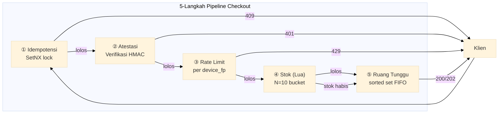

# Flash Sale

Januari 2024. Platform q-commerce Asia Tenggara jalankan flash sale Indomie. 100 unit. 500.000 request bersamaan. Sistem oversell 300%.

12.000 pesanan dibatalkan. Customer service lumpuh tiga hari.

Penyebabnya? Satu race condition. Jendela 50 mikrodetik antara `GET stok` dan `DECRBY stok`. Dua request lihat jumlah stok yang sama. Dua-duanya lolos. Dua-duanya motong.

Dokumen ini menjelaskan 5 safety net yang mencegah kegagalan persis itu — plus 6 lagi yang dibutuhkan aplikasi mobile, bot, dan jaringan tidak stabil.

Port **8102** | 5 file | `types.go` `store.go` `service.go` `handler.go` `main.go`

## Arsitektur



Setiap langkah jadi gerbang. Gagal di titik mana pun → kode HTTP langsung. Tanpa partial state. Tanpa silent degradation.

## Safety Net

### 1. Stok Atomik Lua — Perbaikan 300%

`GET → cek → DECRBY` kelihatannya aman. Tidak.

Tiga request konkuren lihat `stok = 100`. Tiga-tiganya lolos pengecekan. Tiga-tiganya motong. Sekarang stok `97`. Harusnya `-200`. Oversold.

**Solusinya:** satu skrip Lua. Satu operasi Redis. Nol celah.

```lua
local stock = tonumber(redis.call("GET", KEYS[1]) or "0")
local qty = tonumber(ARGV[1])
if stock >= qty then
    redis.call("DECRBY", KEYS[1], qty)
    return {1, stock - qty}
end
return {0, "sold_out"}
```

Redis mengeksekusi skrip secara atomik. Tidak ada perintah lain yang berjalan antara `GET` dan `DECRBY`. Jendela race hilang.

**Stok dipecah ke 10 bucket.** Satu key = hotspot. 10 bucket = 10× throughput. Setiap perangkat di-hash ke bucket primer via FNV-1a. Kalau primer kosong, skrip berjalan ke bucket berikutnya secara berurutan. Satu bucket masih ada stok? Penjualan lanjut.

Tanpa ini: 200 pengguna konkuren. 100 stok. 300 pesanan. 12.000 pelanggan marah.

### 2. Rate Limit per Perangkat — Bukan per IP

Bot farm ganti IP. 1.000 proxy residensial. 5 request per IP = 5.000 request. Rate limiter berbasis IP lihat tidak ada masalah.

**Solusinya:** rate limit berdasarkan `device_fp`, bukan IP.

```go
func (s *Store) CheckRateLimit(ctx context.Context, deviceFP string) (bool, error) {
    now := time.Now().UnixMilli()
    windowStart := now - defaultRateLimitWindow.Milliseconds()
    // Hapus entri di luar window
    // ZCard hitung di dalam window
    // Kalau count >= burst(20) → diblokir (429)
    // Selainnya: ZAdd, Expire, diizinkan
}
```

Burst = 20 per detik. 25 request dari perangkat yang sama → 20 lolos, 5 diblokir. Tidak peduli berapa IP yang dirotasi bot. Limit mengikuti identitas perangkat.

**Rantai ekstraksi fingerprint:** `X-Device-Fingerprint` header dulu (dari klien, prioritas tertinggi). Fallback ke SHA-256 dari `User-Agent + Accept-Language + Platform + Model + RemoteAddr` saat header tidak ada.

Tanpa ini: bot menguras semua stok dalam < 1 detik. Pengguna asli lihat "stok habis" sebelum halaman selesai loading.

### 3. Atestasi HMAC — Rahasia Tidak Pernah Keluar Server

Rate limit menghentikan banjir. Tapi tidak menghentikan pemalsuan token.

Bot mendekompilasi APK-mu. Menemukan secret HMAC yang di-hardcode di file constants. Sekarang bot bisa menghasilkan token atestasi valid. Rate limit? Tidak relevan — bot tinggal ganti 1000 device fingerprint.

**Solusinya:** secret HMAC hanya ada di server. Selalu.

```go
func (s *Store) VerifyAttestation(deviceFP string, expiresAt int64, token string) bool {
    now := time.Now().Unix()
    if d := now - expiresAt; d > 30 || d < -30 { return false }
    mac := hmac.New(sha256.New, s.secret)
    mac.Write([]byte(deviceFP + ":" + strconv.FormatInt(expiresAt, 10)))
    expected := hex.EncodeToString(mac.Sum(nil))
    return hmac.Equal([]byte(expected), []byte(token))
}
```

Klien minta token dari `GET /flash-sale/token?device_fp=X`. Server menandatanganinya. Klien menyertakannya di checkout. Server menghitung ulang dan membandingkan. Tidak ada secret di binary. Dekompilasi sepuasnya — tidak ada yang bisa diekstrak.

Toleransi selisih jam ±30 detik. Jam HP asli bisa meleset. Toleransi 0 detik = pengguna asli ditolak. Toleransi >60 detik = jendela replay terlalu lebar. 30 detik titik tengahnya.

Tanpa ini: token valid bocor dari APK/IPA. Bot banjir dengan atestasi sah. Semua safety net lain jadi tidak berguna.

### 4. Ruang Tunggu Sorted Set — Persisten, Bukan Ephemeral

Stok habis. Pengguna lihat "stok habis." Pengguna pergi. Pendapatan hilang.

Tapi pembatalan terjadi. Pembayaran gagal. Seseorang melepas reservasi. Stok kembali. Stok itu seharusnya diberikan ke orang yang menunggu — bukan refresh acak berikutnya.

**Solusinya:** Redis sorted set. Skor = timestamp masuk (nanodetik). FIFO ketat.

```
ZADD flash:waiting:{product_id} {timestamp} {user_id}   → masuk antrean
ZRANK flash:waiting:{product_id} {user_id}               → posisi real-time
```

Channel in-memory Go mati saat restart. Redis sorted set tidak. Deploy perbaikan saat flash sale berlangsung? Antrean tetap hidup.

Tanpa ini: pengguna lihat "stok habis," tutup aplikasi, buka aplikasi kompetitor. Stok kembali 15 detik kemudian dari pembatalan. Tidak ada yang mengambil.

### 5. Pengaman Idempotensi — Retry Mobile Tidak Terhindarkan

Pengguna tap "Beli." Sinyal 4G lemah. OkHttp auto-retry POST. Server lihat dua request identik.

Tanpa idempotensi: dua pesanan terbuat. Dua stok terpotong. Satu pelanggan bingung dengan dua tagihan.

```go
ok, _ := s.rdb.SetNX(ctx, "flash:idem:"+key, "locked", 30*time.Second).Result()
if !ok {
    // Sudah diproses. Kembalikan hasil yang di-cache.
    cached, _ := s.rdb.Get(ctx, "flash:idem:"+key+":result").Result()
    return &CheckoutResponse{Status: StatusIdempotencyConflict}, nil
}
```

SetNX lock: 30 detik. Request pertama dapat lock dan memproses. Request kedua menemukan lock → langsung kembalikan hasil cache. HTTP 409 Conflict.

Cache bertahan 10 menit. Pengguna retry 2 menit kemudian? Hasil sama. Tanpa duplikat. Tanpa tagihan ganda.

Tanpa ini: pengguna buka aplikasi, lihat dua pesanan sukses, hubungi CS. CS habiskan berjam-jam rekonsiliasi. Kepercayaan terkikis.

## Titik Akhir API

| Method | Path | Fungsinya |
|--------|------|-----------|
| `POST` | `/flash-sale/checkout` | Jalankan pipeline 5 langkah penuh |
| `POST` | `/flash-sale/release` | Kembalikan stok. Idempoten. Timeout pembayaran? Panggil ini. |
| `GET` | `/flash-sale/queue-status` | Di mana posisi saya di antrean? |
| `GET` | `/flash-sale/token` | Dapatkan token atestasi sebelum checkout |

### POST /flash-sale/checkout

```json
// Request
{
  "product_id": "flash-indomie-2026",
  "user_id": "user-abc",
  "qty": 1,
  "device_fp": "fp-iphone-budi",
  "attestation": "<token-hmac>",
  "expires_at": 1719000030,
  "idempotency_key": "550e8400-e29b-41d4-a716-446655440000"
}

// 200 — dikonfirmasi
{"data": {"order_id": "ord_flash_99", "reservation_id": "RES-abc123", "status": "completed"}}

// 202 — masuk antrean (ruang tunggu)
{"data": {"status": "queued", "position": 42}}

// 401 — atestasi tidak valid
// 429 — rate limit (20 req/dtk per perangkat terlampaui)
// 409 — idempotency key duplikat (hasil cache dikembalikan)
```

## Uji Skenario — 11 Validasi Dunia Nyata

| # | Skenario | Yang Diuji | Yang Rusak Tanpanya |
|---|----------|-----------|-------------------|
| 1 | Budi beli Indomie | Pipeline penuh: 5 langkah lolos | Stok hilang diam-diam saat gagal di tengah |
| 2 | Panik double-tap | Idempotency key sama → 409 | OkHttp retry → 2 pesanan, 2 tagihan |
| 3 | 200 pengguna, 100 stok | Lua atomik cegah oversell | Race → 300% oversell (insiden 2024) |
| 4 | Bot: token palsu + 30 spam | 401 + 429 dari perangkat sama | Bot kuras stok dalam <1dtk |
| 5 | Pengguna ke-101, stok habis | Masuk ruang tunggu, posisi ZRank | Pengguna lihat "stok habis," pergi selamanya |
| 6 | Timeout pembayaran 15dtk | Release kembalikan stok atomik | Stok hantu: tereservasi tapi tidak pernah terjual |
| 7 | Token 31dtk kedaluwarsa | Selisih ±30dtk → 401 | Toleransi 0dtk tolak pengguna asli |
| 8 | GET /token | Secret server-side, tidak pernah di binary | Secret di APK → didekompilasi → token palsu |
| 9 | 25 request, 1 perangkat | Sliding window per device_fp, burst=20 | Berbasis IP: 1000 proxy → 5000 request |
| 10 | Mobile 4G→WiFi handoff | OkHttp retry → 409, hasil cache | 2 POST identik → 2 pesanan, 2 tagihan |
| 11 | Dua perangkat, FP berbeda | Hash berbeda → bucket berbeda → keduanya sukses | Tabrakan bucket tunggal → false sold-out |

11 pengujian. 11 bukti bahwa setiap safety net memblokir mode kegagalan nyata. Bukan teoretis. Semua divalidasi terhadap instance Redis yang berjalan.

## Keputusan Desain

| Keputusan | Mengapa |
|-----------|--------|
| **Lua atomik, bukan WATCH/MULTI** | WATCH retry saat kontensi. Lua: 1 round trip, 0 retry. |
| **Device FP, bukan IP** | Rotasi IP = 1000× bypass. Identitas perangkat mengikuti pengguna. |
| **HMAC verifikasi lokal, bukan remote service** | 1ms lokal. 10ms+ panggilan remote. Di 500K RPM, itu 5 detik latensi dihemat per detik. |
| **Sorted set, bukan antrean in-memory** | Deploy mematikan channel. Redis tetap hidup. ZRank O(log N). |
| **SetNX idempotensi, bukan UUID saja** | UUID mencegah tabrakan. SetNX mencegah replay. Masalah berbeda. |

## Source Code

[Lihat di GitHub](https://github.com/faisalaffan/faisalaffan-design-system/blob/dev/services/flash-sale/main.go)
