# Flash Sale

Januari 2024. Platform q-commerce Asia Tenggara jalankan flash sale Indomie. 100 unit. 500.000 request bersamaan. Sistem oversell 300%.

12.000 pesanan dibatalkan. Customer service lumpuh tiga hari.

Penyebabnya? Satu race condition. Selisih 50 mikrodetik antara `GET stok` dan `DECRBY stok`. 2 request lihat jumlah stok yang sama. Dua-duanya lolos. Dua-duanya motong.

Artikel ini menjelaskan 7 Proof Of Concept untuk mencegah point of failure itu.

## Pola Dasar — Rebutan vs Antrian

Pain point: bikin sistem flash sale yang nggak collapse pas traffic spike.

Semua pola di artikel ini turunan dari 2 pendekatan fundamental:


1. **Rebutan** — semua user serentak coba checkout. Yang cepat menang. Contoh: Shopee Flash Sale, Race pattern.
2. **Antrian** — user masuk waiting room dulu, diproses satu per satu. Contoh: Slot Pool.

**Slot Pool — kenapa butuh antrian?**


1. **Batasi request konkuren** — tanpa antrian, semua request ngehantam server barengan
2. **CPU + RAM terkendali** — traffic tinggi tanpa rem = resource exhaustion

100 user → 100K req/detik → thread pool habis → timeout di mana-mana.


**Kenapa Rate Limiter nggak cukup?**

Rate limiter batasi req/detik per user/IP. Tapi di flash sale, satu flow checkout butuh banyak request internal (cek stok, potong stok, reservasi, catat antrean). Rate limiter cuma ngelimit siapa yang masuk — bukan berapa yang jalan barengan.


## 5 Pola Flash Sale

### 1. Race (Optimistic / Time-Gated)
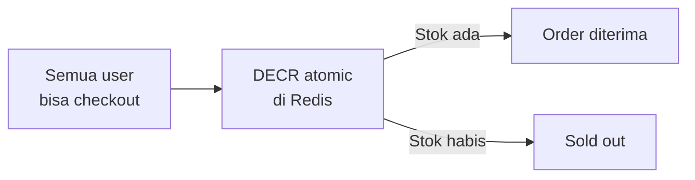
**Use case:** Shopee Flash Sale, Tokopedia Serbu  
**Astro:** ⚠️ Simpel, nggak perlu antrean. Tapi fairness nol — bot selalu menang. Cocok buat barang banyak (>1000 unit), flash sale rutin.

### 2. Lottery / Raffle
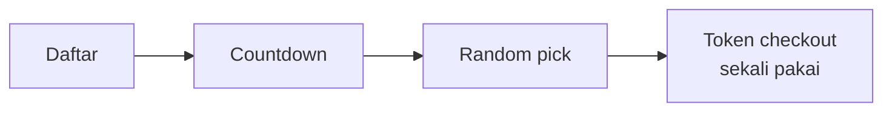
**Use case:** SNKRS App, PS5 drop  
**Astro:** ❌ Flow ① daftar → ② tunggu countdown → ③ draw → ④ cek hasil → ⑤ checkout. User grocery nggak mau nunggu undian cuma buat tau dapet bayam apa nggak. Buka GrabMart: pilih → bayar → 15 menit sampe. Nggak ada fase "maaf, kamu kurang beruntung."

### 3. Weighted Queue
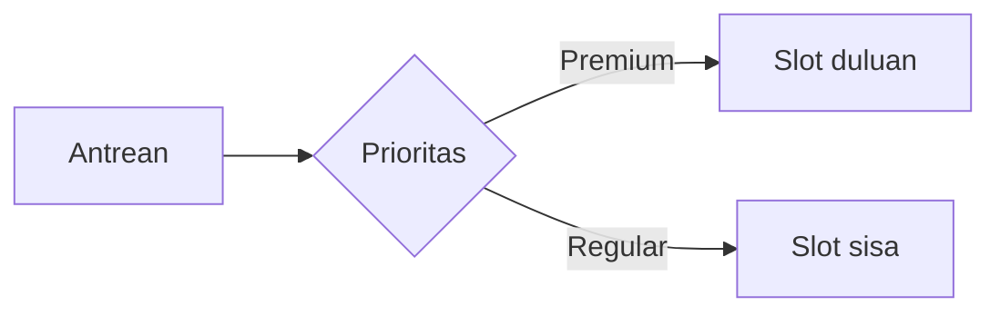
**Use case:** Ticketmaster, airline presale · **Astro:** ⚠️ Buat Astro Prime tier

### 4. Voucher Pre-claim
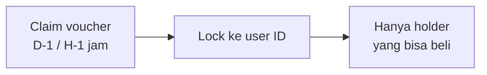
**Use case:** Tokopedia Koin, Grab promo  
**Astro:** ✅ Sebar beban T=0 — claim voucher disebar 24 jam sebelum sale, bukan 500K request di detik yang sama. Yang bisa checkout cuma pemegang voucher.

### 5. Time-slotted (Astro-native)
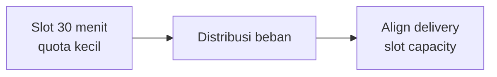
**Astro:** ✅ Paling pas — hub load predictable, "35 menit" jadi natural boundary

---

## Matrix Ringkas

| Pattern | Fairness | Complexity | Astro Fit |
|---|---|---|---|
| Race (Optimistic) | None | None | ⚠️ Rutin >1000 unit |
| Slot Pool (FIFO) | Low | Low | ✅ Current |
| Lottery | High | Medium | ❌ |
| Weighted Queue | Medium | High | ⚠️ Premium tier |
| Voucher Pre-claim | High | Medium | ✅ Strong |
| Time-slotted | High | Medium | ✅ Best fit |

---

## Decision Flow — Pilih Pola Mana?

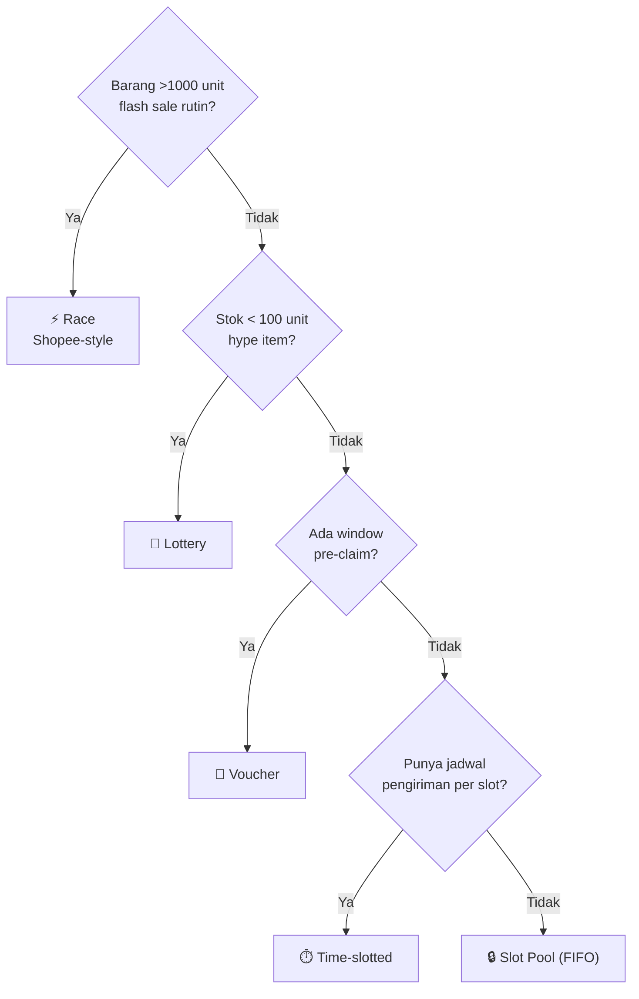

---

## Rekomendasi Astro — Ranked by Fit

| Tier | Pola | Kenapa |
|------|------|--------|
| 🥇 | **Time-slotted** | Delivery slot capacity = natural boundary. "35 menit" bukan bug, tapi feature. |
| 🥈 | **Voucher Pre-claim** | Sebar beban T=0. Claim D-1, checkout H. Server nggak kena lonjakan barengan. |
| 🥉 | **Slot Pool (FIFO)** | Udah jalan. 7 safety net udah proven. |
| ⚡ | **Race** | Barang >1000 unit, flash sale rutin, fairness bukan concern utama. |
| 💎 | **Weighted Queue** | Astro Prime retention tool. Bukan buat semua flash sale. |

Lottery: skip. Nggak cocok model grocery.

**Komposisi ideal Astro:** Slot Pool untuk flash sale reguler + Voucher Pre-claim untuk event besar + Time-slotted untuk delivery-aware sale.

---

**Interview answer:** kombinasi **Voucher Pre-claim + Time-slotted + Per-hub quota** = jawaban paling defensible secara engineering untuk "improve flash sale Astro."


## Arsitektur

Architecture berikut implementasi **Slot Pool (FIFO)** — pola #1 di matrix atas — dengan Lottery Pool sebagai jalur alternatif untuk limited drop.

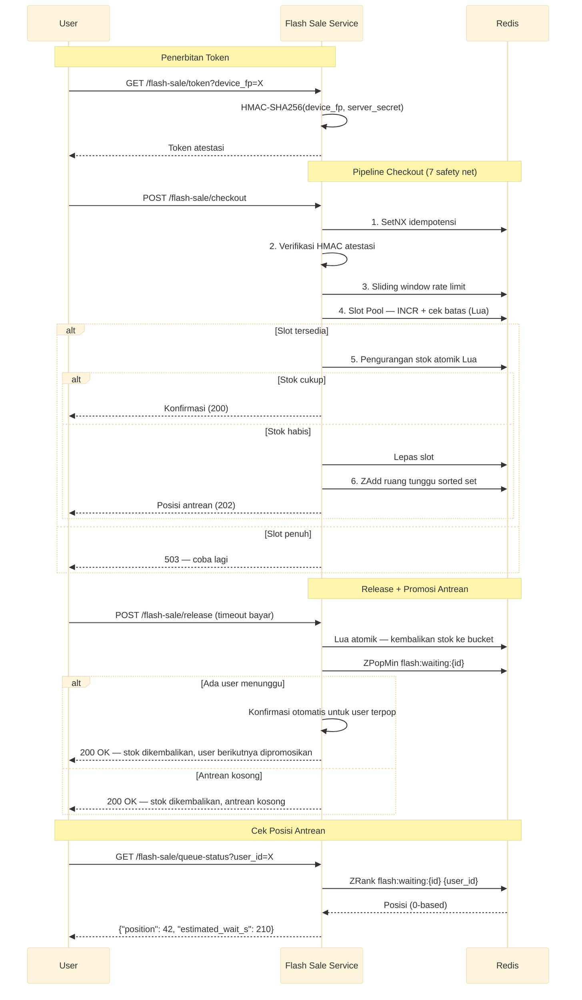

**Detil 10 Bucket + Slot Pool (sudah tercakup di pipeline atas):** Stok disebar ke 10 bucket via `FNV-1a(device_fp) % 10`. Bucket habis → fallback sekuensial. Semua habis → waiting room. Slot Pool batasi 1000 sesi konkuren via `INCR + cek batas` di Lua. Penuh → 503. Selesai/TTL → `DECR` balikin slot.

**Race — Shopee-style (Optimistic DECR)**

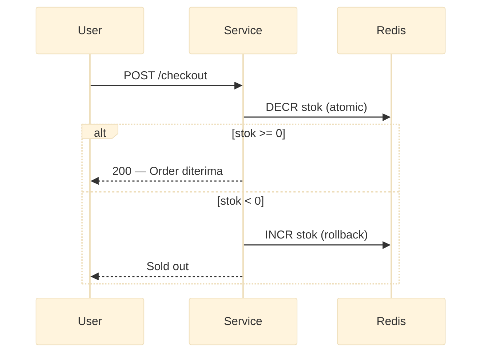

Nggak ada antrean. Nggak ada slot. Cuma `DECR` + rollback kalau minus. Paling simpel, paling cepat, paling unfair.

**Weighted Queue — Priority Lanes**

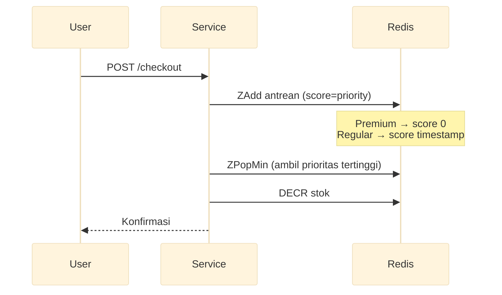

Premium member dapet score rendah → di-pop duluan. Regular dapet score timestamp → antri natural. Satu antrean, dua jalur.

**Voucher Pre-claim — Two-Phase**

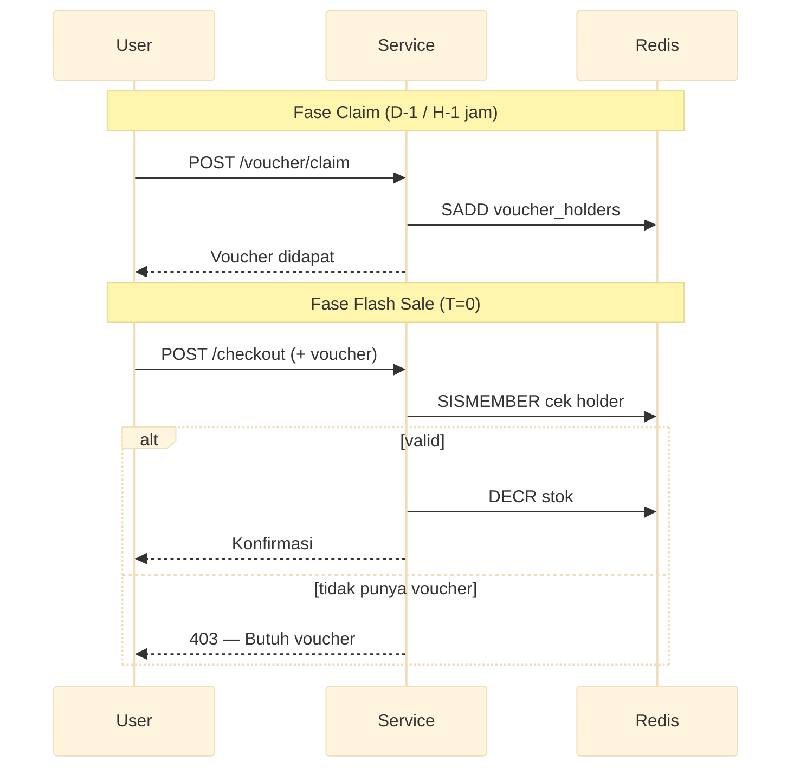

Claim disebar sebelum T=0. Yang bisa checkout cuma pemegang voucher. Server nggak dibanting 500K request serentak.

**Time-slotted — Per-Slot + Bucket Shard**

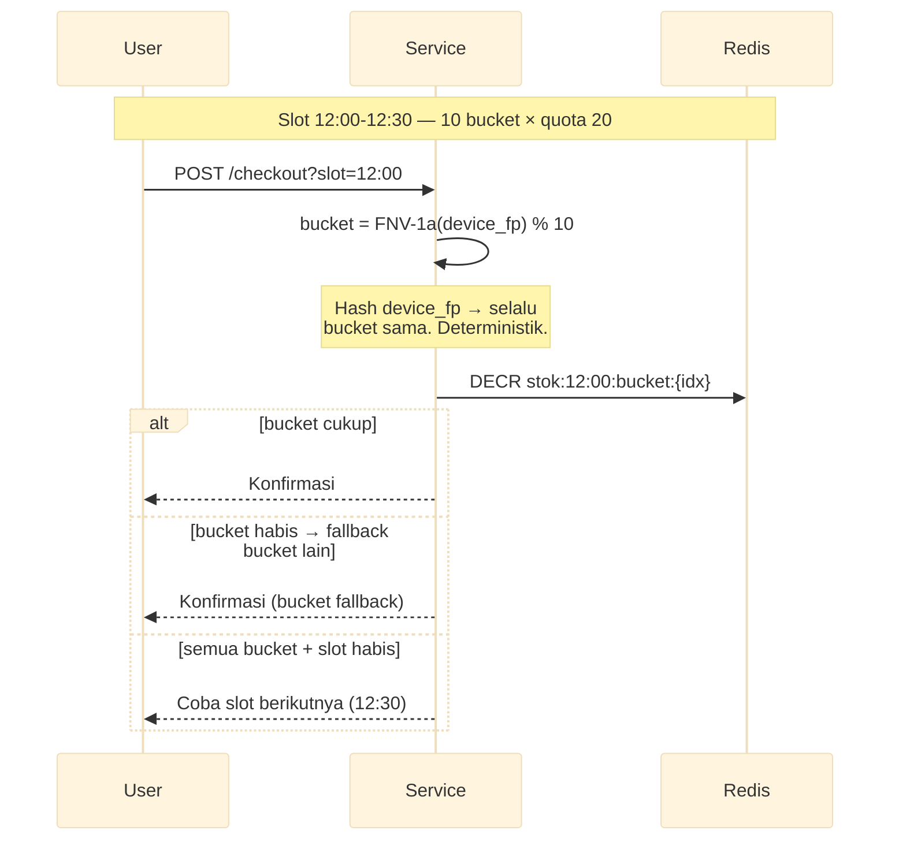

Stok di-shard 2 dimensi: waktu (slot) × bucket (10). Satu slot 12:00-12:30 nggak cuma 1 key — tapi 10 key. **Tanpa bucket di dalam slot, 1 key per slot tetep hotspot.** Dengan bucket, beban nyebar 10× per slot.

Bucket nggak perlu sync satu sama lain. Masing-masing independent — cuma di-`DECR` atomic via Lua. Total stok slot = jumlah semua bucket (misal 200 = 10 bucket × 20). Satu-satunya "koordinasi" adalah fallback: kalau bucket primer habis, coba bucket berikutnya. Align natural sama jadwal delivery.

**Lottery Pool — Fairness Tanpa Race**

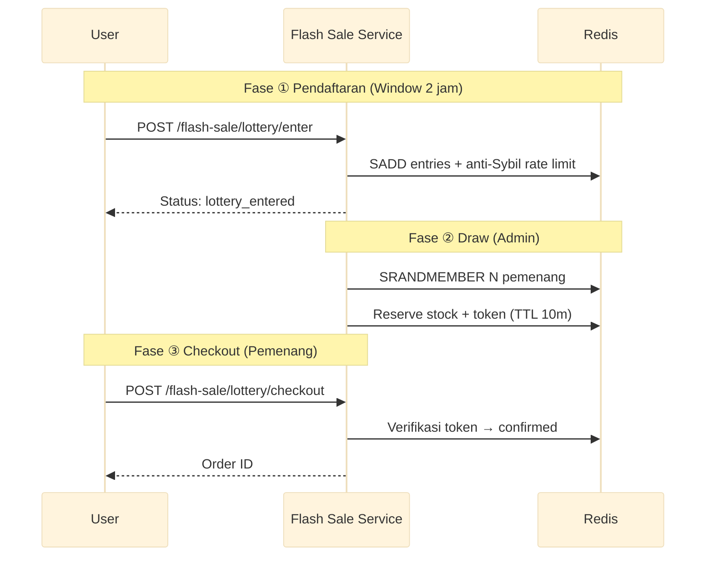

**Tech Stack**

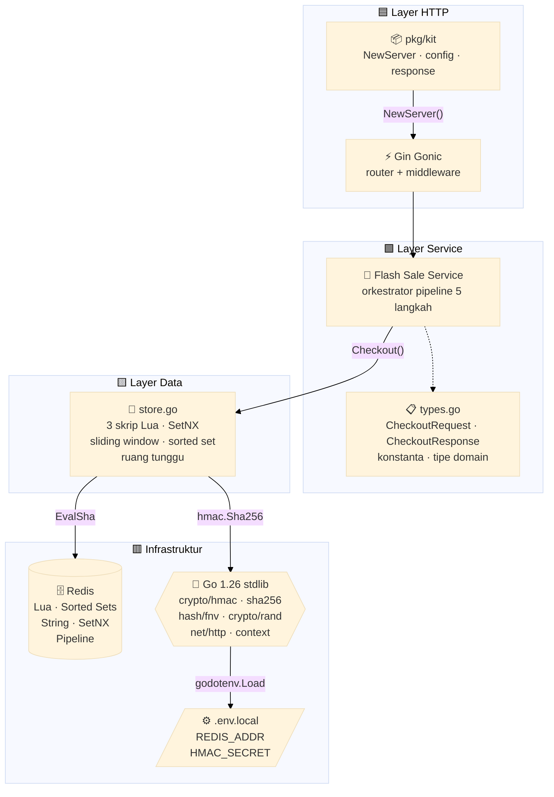

Setiap langkah jadi gerbang. Gagal di titik mana pun → kode HTTP langsung. Tanpa partial state. Tanpa silent degradation.

## Safety Net

### 1. Stok Atomik Lua — Fix Oversell 300%

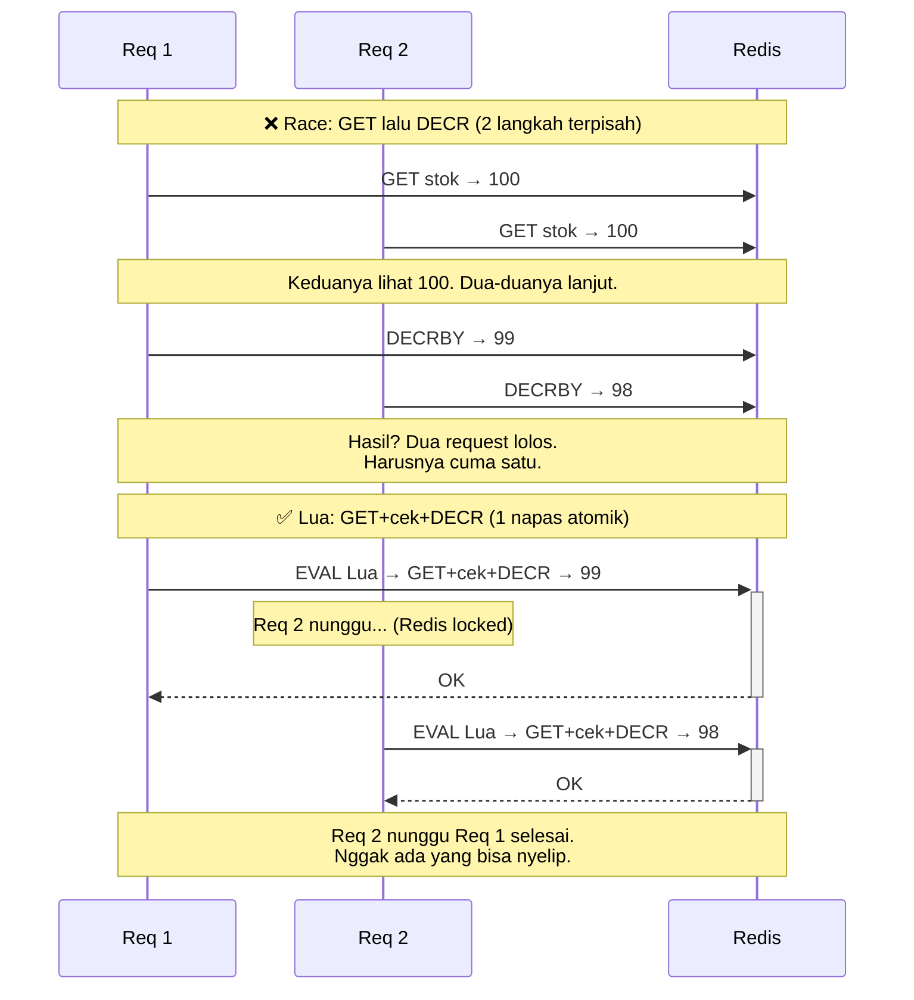

Insiden Januari 2024: 100 stok, 300 pesanan masuk, 12.000 pembatalan — semua gara-gara 50 mikrodetik jendela race di antara `GET` dan `DECRBY`. Lua ngehapus jendela itu.

Skripnya:

```lua
local stock = tonumber(redis.call("GET", KEYS[1]) or "0")
local qty = tonumber(ARGV[1])
if stock >= qty then
    redis.call("DECRBY", KEYS[1], qty)
    return {1, stock - qty}
end
return {0, "sold_out"}
```

Redis ngejalanin skrip Lua kayak transaksi database — all or nothing. Begitu Lua mulai, nggak ada perintah lain yang bisa ngintip di antara `GET` dan `DECRBY`. Jendela 50 mikrodetik yang bikin insiden 2024 itu? Hilang. Bersih.

**Stok nggak cuma satu key — tapi 10 bucket.** Ini trik yang jarang diceritain.

Satu key Redis itu hotspot. 500.000 request ngehantam satu key? CPU Redis nangis. 10 bucket = beban nyebar. 10× throughput. Aman.

Cara kerjanya gini: tiap `device_fp` di-hash pake FNV-1a, dimodulo 10, dapet bucket primer. Misal jatuh di bucket 3. Kalau bucket 3 masih ada stok → gas. Kalau habis? Jangan nyerah dulu — coba bucket 4, 5, 6… sampe ketemu yang masih ada stok. Semua bucket kosong? Baru deh `sold_out`.

Tanpa bucket + Lua: 200 orang rebutan 100 stok. Hasil akhir? 300 pesanan. 12.000 orang ngamuk. CS tepar 3 hari.

### 2. Rate Limit per Perangkat — Bukan per IP

Cerita lama. Rate limiter liat IP. Bot farm ketawa.

Mereka punya 1.000 proxy residensial. 5 request per IP × 1.000 IP = 5.000 request. Rate limiter berbasis IP cuma bisa bengong. "Requestnya beda-beda IP, aman kok."

Padahal semua dari satu orang.

**Solusinya:** rate limit pake `device_fp`, bukan IP.

```go
func (s *Store) CheckRateLimit(ctx context.Context, deviceFP string) (bool, error) {
    now := time.Now().UnixMilli()
    windowStart := now - defaultRateLimitWindow.Milliseconds()
    // Hapus entri di luar window
    // ZCard hitung di dalam window
    // Kalau count >= burst(20) → diblokir (429)
    // Selainnya: ZAdd, Expire, diizinkan
}
```

Burst = 20 per detik per perangkat. Lo bisa gonta-ganti IP seribu kali — tetep kena limit karena `device_fp` lo sama. 25 request? 20 lolos, 5 kena 429. Bot gigit jari.

**Gimana cara dapetin `device_fp`-nya?** Ada rantai ekstraksi:

Prioritas pertama: header `X-Device-Fingerprint` dari klien. Ini yang paling akurat. Tapi kalau headernya nggak ada (entah kenapa), kita fallback ke SHA-256 dari gabungan `User-Agent + Accept-Language + Platform + Model + RemoteAddr`. Jejak digital yang susah dipalsuin.

Tanpa ini: bot ngabisin semua stok dalam < 1 detik. Lo buka app, loading masih muter, udah liat "stok habis" aja.

### 3. Atestasi HMAC — Secret Nggak Pernah Nyentuh Binary

Rate limit udah nahan banjir. Tapi ada yang lebih serem: pemalsuan token.

Bot nggak perlu pinter. Mereka tinggal download APK lo dari Play Store. Dekompilasi. Cari string yang keliatan kayak secret key. Dan… ketemu.

```java
// Di dalem APK lo — keliatan banget
String HMAC_SECRET = "super-secret-key-2024";
```

Sekarang bot bisa generate token atestasi sendiri. Valid. Ditandatangani dengan secret lo. Rate limit? Tinggal ganti `device_fp` — toh bot bisa bikin 1.000 fingerprint palsu.

**Solusinya simpel: secret cuma di server.** Nggak pernah nyentuh binary. Nggak pernah nyentuh klien.

```go
func (s *Store) VerifyAttestation(deviceFP string, expiresAt int64, token string) bool {
    now := time.Now().Unix()
    if d := now - expiresAt; d > 30 || d < -30 { return false }
    mac := hmac.New(sha256.New, s.secret)
    mac.Write([]byte(deviceFP + ":" + strconv.FormatInt(expiresAt, 10)))
    expected := hex.EncodeToString(mac.Sum(nil))
    return hmac.Equal([]byte(expected), []byte(token))
}
```

Alurnya gini: klien minta token dulu ke `GET /flash-sale/token?device_fp=X`. Server tandatanganin pake secret (yang cuma server tau). Klien dapet token, kirim bareng request checkout. Server hitung ulang, bandingkan. Cocok? Lanjut.

Dekompilasi APK sampe mabok juga nggak bakal nemu secret. Karena emang nggak ada di sana.

**Kenapa toleransi ±30 detik?** Jam HP itu mahluk chaos. Ada yang kecepetan 2 detik. Ada yang kelambatan 15 detik. Toleransi 0 detik = lo nolak pengguna asli yang jam HP-nya meleset. Toleransi >60 detik = lo kasih bot jendela replay segede gapura. 30 detik itu sweet spot: cukup buat tolerir jam ngaco, cukup sempit buat cegah replay attack.

Tanpa ini: secret bocor. Token valid banjir. Semua safety net lain? Percuma.

### 4. Ruang Tunggu Sorted Set — Yang Nunggu Duluan, Dapet Duluan

Adegan yang terlalu sering: stok habis. User lihat "stok habis." User tutup app. User buka Shopee.

Tapi… 15 detik kemudian ada yang batal bayar. Stok balik 1. Harusnya stok itu jatuh ke user yang udah nunggu dari tadi. Bukan ke random user yang kebetulan refresh di detik yang tepat.

**Solusinya:** Redis sorted set. Skor = timestamp masuk (nanodetik). FIFO murni.

```
ZADD flash:waiting:{product_id} {timestamp} {user_id}   → antri
ZRANK flash:waiting:{product_id} {user_id}               → posisi lo sekarang
```

Kenapa bukan channel in-memory Go? Gampang: channel mati pas restart. Deploy doang pas flash sale? Channel ilang, antrean ilang, user ilang. Redis sorted set? Tetep idup. Mau deploy 10 kali juga antrean aman.

Tanpa ini: user liat "stok habis," pindah ke kompetitor. Stok balik 15 detik kemudian. Nggak ada yang ngambil. Revenue ngilang, user ngilang. Dua-duanya.

### 5. Pengaman Idempotensi — Sinyal Lemah Jangan Bikin Lo Bayar Dua Kali

User tap "Beli." Sinyal 4G ngambang. Loading… loading… 3 detik. User belum liat apa-apa.

Tapi di belakang layar, OkHttp udah auto-retry POST. Server nerima dua request. Identik. Cuma beda 400ms. Tanpa idempotensi? Dua pesanan terbuat. Dua stok kepotong. Satu user dapet dua tagihan.

Pernah ngalamin sendiri? Saya juga.

```go
ok, _ := s.rdb.SetNX(ctx, "flash:idem:"+key, "locked", 30*time.Second).Result()
if !ok {
    // Udah diproses sebelumnya. Kasih hasil yang sama.
    cached, _ := s.rdb.Get(ctx, "flash:idem:"+key+":result").Result()
    return &CheckoutResponse{Status: StatusIdempotencyConflict}, nil
}
```

Simpel: `SetNX`. Cuma satu request yang dapet lock. Request pertama jalan normal. Request kedua (retry OkHttp) ketemu lock → langsung balikin hasil cache → HTTP 409 Conflict. Nggak bikin pesanan baru. Nggak motong stok lagi.

Cache-nya tahan 10 menit. User retry 2 menit kemudian? Hasil persis sama. Satu pesanan. Satu tagihan.

Tanpa ini: user buka app, liat dua pesanan sukses, langsung telpon CS. CS berjam-jam rekonsiliasi. Trust? Hancur.

### 6. Slot Pool Semaphore — DB Lo Punya Batas, Bukan Cuma Rate

Rate limiter ngelimit request per detik. Tapi gak ngelimit berapa banyak sesi yang jalan **barengan**.

Gini analoginya: lo punya restoran 50 kursi. Rate limiter itu kayak ngatur berapa orang boleh masuk per menit. Tapi lo gak ngelimit berapa orang yang boleh duduk barengan. Hasilnya? 200 orang di dalem restoran, 50 kursi. Dapur (database) chaos.

**Inilah kenapa Slot Pool ada.**

Rate limiter per detik nggak cukup ngelindungin database. Satu transaksi checkout butuh banyak operasi: cek stok, potong stok, bikin reservasi, catat antrean. Semua ini ngehantam Redis. 1000 user jalan barengan? Redis masih oke. 5000? Mulai ngedrop. 10.000? Koneksi abis, timeout di mana-mana.

```lua
-- Satu napas di Redis. INCR → cek → kalau > max → DECR (anti drift).
local count = redis.call("INCR", KEYS[1])
if count <= tonumber(ARGV[1]) then
    redis.call("SETEX", KEYS[2], ARGV[2], count)
    return {1, count}
end
redis.call("DECR", KEYS[1])
return {0, tonumber(ARGV[1])}
```

Cara kerjanya:
1. **`INCR` counter** — tiap checkout naikin counter slot
2. **Cek batas** — masih di bawah `defaultMaxSlots` (1000)? Masuk. Dapet slot + TTL 15 menit.
3. **Penuh? `DECR` balik** — ini penting. Tanpa `DECR`, counter bakal drift ke 1500 padahal maksimalnya 1000. Slot hantu.
4. **Transaksi beres atau TTL abis** — slot dilepas. `DECR` counter + `DEL` session key. Siap direbut user berikutnya.

```go
func (s *Store) AcquireSlot(ctx context.Context, productID, sessionID string, maxSlots int, ttl time.Duration) (bool, int, error) {
    countKey := keySlotCount + productID
    sessionKey := keySlotSession + sessionID
    ttlSec := int64(ttl.Seconds())
    res, err := s.rdb.EvalSha(ctx, s.slotSHA, []string{countKey, sessionKey}, maxSlots, ttlSec).Slice()
    if err != nil {
        return false, 0, err
    }
    ok := res[0].(int64) == 1
    count := int(res[1].(int64))
    return ok, count, nil
}
```

**Kenapa 1000 slot?** Hasil stress testing K6. Lo harus cari breaking point infrastruktur lo sendiri. Jalankan K6 di staging dengan metrik agresif, naikin concurrency sampe Redis mulai ngedrop. Ambil angka 70% dari breaking point itu. Itu `defaultMaxSlots` lo.

**Kenapa TTL 15 menit?** Cukup buat user mikir + bayar. Terlalu pendek → user keburu ke-expire pas lagi bayar. Terlalu panjang → slot nempel di user yang udah nyerah duluan. 15 menit titik tengahnya.

**Flow di pipeline:**
- **Slot didapat** → lanjut reserve stok
- **Stok cukup** → slot dipegang (TTL 15m). Lindungi DB selama transaksi.
- **Stok habis** → slot dilepas segera. User masuk waiting room, gak perlu slot lagi.
- **Slot penuh** → HTTP 503. "Coba lagi ya."

Tanpa ini: rate limiter bilang "oke, 20 req/dtk per device aman." Tapi 1000 device beda masing-masing kirim 20 req/dtk = 20.000 sesi konkuren. Redis lo timeout. Database lo collapse. Semua safety net lain? Nggak relevan kalau infrastrukturnya udah tepar duluan.

### 7. Lottery Pool — Semua Dapat Kesempatan, Bukan Cuma Joki

Queue FIFO ngasih fairness "siapa duluan." Slot Pool ngelimit sesi konkuren. Tapi keduanya masih model **race**: kecepatan yang nentuin siapa menang. Bot selalu lebih cepat dari manusia.

Lottery Pool beda. **Semua daftar dulu. Sistem pilih pemenang random.** Speed nggak relevan. Bot nggak bisa curang.

**Three-phase flow:**

**Fase 1 — Pendaftaran (Window 2 Jam)**
```go
func (s *Store) EnterLottery(ctx context.Context, productID, userID string) error {
    pipe := s.rdb.Pipeline()
    pipe.SAdd(ctx, keyLotteryEntries+productID, userID)   // SADD atomic, auto-dedup
    pipe.Expire(ctx, keyLotteryEntries+productID, defaultLotteryWindow)
    _, err := pipe.Exec(ctx)
    return err
}
```

User daftar kapan aja selama window. SADD natural dedup — satu user = satu entry. Daftar detik pertama sama detik terakhir hasilnya sama. Ada rate limiter per `device_fp` di layer service buat cegah Sybil (satu orang bikin 1000 akun).

**Fase 2 — Draw (Admin, setelah window tutup)**
```go
func (s *Store) DrawLotteryWinners(ctx context.Context, productID string, winnerCount int, checkoutTTL time.Duration) ([]string, int, error) {
    // Cek belum drawn → SRANDMEMBER N pemenang random
    winners, _ := s.rdb.SRandMemberN(ctx, keyLotteryEntries+productID, int64(actualCount)).Result()
    // Generate token checkout buat tiap pemenang
    for _, userID := range winners {
        token := generateID("LTOK")
        // SETEX token dengan TTL (10 menit)
        s.rdb.HSet(ctx, keyLotteryToken+token, "user_id", userID, "expires_at", expiresAt, "status", "pending")
    }
}
```

SRANDMEMBER ngambil N random entries. Hasilnya deterministik — draw kedua balikin pemenang yang sama (idempotent). Tiap pemenang dapet checkout token dengan TTL 10 menit. **Stok langsung direserve** lewat ReserveStock yang sama — pemenang nggak perlu rebutan lagi. Udah dijamin.

**Fase 3 — Checkout (Pemenang, dalam TTL 10 menit)**
```go
func (s *Service) LotteryCheckout(ctx context.Context, lotteryToken string) (*CheckoutResponse, error) {
    _, _, err := s.store.VerifyLotteryToken(ctx, lotteryToken)
    // Token valid → konfirmasi → order completed
    s.store.ConfirmLotteryToken(ctx, lotteryToken)
    return &CheckoutResponse{OrderID: generateID("LOTORD"), Status: StatusCompleted}, nil
}
```

Token diverifikasi. Kalau valid + belum dipakai → langsung confirmed. Token replay? Ditolak. Winner no-show sampe TTL abis? Reservation auto-expire, stok balik. 

**Kenapa nggak semua pakai Lottery?** Karena di q-commerce, ada case yang butuh speed (Shopee Flash Sale — 10.000 unit diskon 50%). Lottery overkill di sana. Tapi buat limited drops (100 unit Indomie special edition, sneaker collab, tiket event) — Lottery lebih fair.

**Risk yang udah dihandle:**
- Sybil attack → rate limiter per `device_fp` di entry
- Winner no-show → TTL 10 menit ketat, reservation auto-release
- Double claim → token confirmed flag + idempotent draw
- Perceived unfairness → SRANDMEMBER seeded by Redis (bisa di-upgrade ke provably fair kalau perlu)

Tanpa ini: fairness hilang. Bot selalu menang race. User asli frustrasi. Brand trust hancur karena scalper menguasai stok. **Lottery bukan cuma soal siapa yang dapet — tapi soal siapa yang *merasa* punya kesempatan.**

## Titik Akhir API

| Method | Path | Fungsinya |
|--------|------|-----------|
| `POST` | `/flash-sale/checkout` | Jalankan pipeline 7 langkah penuh |
| `POST` | `/flash-sale/release` | Kembalikan stok + lepas slot. Idempoten. |
| `GET` | `/flash-sale/queue-status` | Di mana posisi saya di antrean? |
| `GET` | `/flash-sale/token` | Dapatkan token atestasi sebelum checkout |
| `GET` | `/flash-sale/slot-status` | Cek kapasitas Slot Pool tersisa |
| `POST` | `/flash-sale/lottery/enter` | Daftar lottery (dalam window) |
| `POST` | `/flash-sale/lottery/draw` | Admin: pilih pemenang random |
| `GET` | `/flash-sale/lottery/result` | Cek hasil lottery — menang atau kalah? |
| `POST` | `/flash-sale/lottery/checkout` | Pemenang konfirmasi checkout

| Method | Path | Fungsinya |
|--------|------|-----------|
| `POST` | `/flash-sale/checkout` | Jalankan pipeline 6 langkah penuh |
| `POST` | `/flash-sale/release` | Kembalikan stok + lepas slot. Idempoten. |
| `GET` | `/flash-sale/queue-status` | Di mana posisi saya di antrean? |
| `GET` | `/flash-sale/token` | Dapatkan token atestasi sebelum checkout |
| `GET` | `/flash-sale/slot-status` | Cek kapasitas Slot Pool tersisa |

### POST /flash-sale/checkout

```json
// Request
{
  "product_id": "flash-indomie-2026",
  "user_id": "user-abc",
  "qty": 1,
  "device_fp": "fp-iphone-budi",
  "attestation": "<token-hmac>",
  "expires_at": 1719000030,
  "idempotency_key": "550e8400-e29b-41d4-a716-446655440000"
}

// 200 — dikonfirmasi
{"data": {"order_id": "ord_flash_99", "reservation_id": "RES-abc123", "status": "completed"}}

// 202 — masuk antrean (ruang tunggu)
{"data": {"status": "queued", "position": 42}}

// 401 — atestasi tidak valid
// 429 — rate limit (20 req/dtk per perangkat terlampaui)
// 409 — idempotency key duplikat (hasil cache dikembalikan)
// 503 — slot pool penuh (coba lagi beberapa saat)
```

## Uji Skenario — 19 Validasi Dunia Nyata

| # | Skenario | Yang Diuji | Yang Rusak Tanpanya |
|---|----------|-----------|-------------------|
| 1 | Budi beli Indomie | Pipeline penuh: 7 langkah lolos | Stok hilang diam-diam saat gagal di tengah |
| 2 | Panik double-tap | Idempotency key sama → 409 | OkHttp retry → 2 pesanan, 2 tagihan |
| 3 | 200 pengguna, 100 stok | Lua atomik cegah oversell | Race → 300% oversell (insiden 2024) |
| 4 | Bot: token palsu + 30 spam | 401 + 429 dari perangkat sama | Bot kuras stok dalam <1dtk |
| 5 | Pengguna ke-101, stok habis | Masuk ruang tunggu, posisi ZRank | Pengguna lihat "stok habis," pergi selamanya |
| 6 | Timeout pembayaran 15dtk | Release kembalikan stok atomik | Stok hantu: tereservasi tapi tidak pernah terjual |
| 7 | Token 31dtk kedaluwarsa | Selisih ±30dtk → 401 | Toleransi 0dtk tolak pengguna asli |
| 8 | GET /token | Secret server-side, tidak pernah di binary | Secret di APK → didekompilasi → token palsu |
| 9 | 25 request, 1 perangkat | Sliding window per device_fp, burst=20 | Berbasis IP: 1000 proxy → 5000 request |
| 10 | Mobile 4G→WiFi handoff | OkHttp retry → 409, hasil cache | 2 POST identik → 2 pesanan, 2 tagihan |
| 11 | Dua perangkat, FP berbeda | Hash berbeda → bucket berbeda → keduanya sukses | Tabrakan bucket tunggal → false sold-out |
| 12 | Budi cek posisi antrean | GET /queue-status → ZRank real-time | Pengguna tebak-tebak posisi, frustrasi, churn |
| 13 | Stok kembali setelah release | ZPopMin → konfirmasi otomatis user antrean | Stok balik tapi antrean jalan terus — hole in UX |
| 14 | 1500 user, 1000 slot | Slot Pool batasi sesi konkuren ≤ maxSlots | DB collapse: 1500 sesi barengan tanpa rem |
| 15 | Slot dilepas setelah release | DECR slot count, kapasitas balik | Slot leak: pool penuh permanen, user ditolak terus |
| 16 | Stok habis vs slot penuh | Dua jalur beda: queued (202) vs slot_full (503) | User bingung — "slot penuh" dan "stok habis" kelihatan sama |
| 17 | 100 user daftar lottery | SADD dedup — 1 user = 1 entry | Sybil: user daftar 1000 akun, odds timpang |
| 18 | Draw 10 pemenang dari 100 | SRANDMEMBER + stok tereservasi otomatis | Pemenang rebutan stok lagi → lottery pointless |
| 19 | Pemenang checkout pakai token | Token verifikasi + confirmed flag + replay reject | Token replay → stok di-hack, fairness hancur |

19 pengujian. 19 bukti bahwa setiap safety net memblokir mode kegagalan nyata. Bukan teoretis. Semua divalidasi terhadap instance Redis yang berjalan.

## Keputusan Desain

| Keputusan | Mengapa |
|-----------|--------|
| **Lua atomik, bukan WATCH/MULTI** | WATCH retry saat kontensi. Lua: 1 round trip, 0 retry. |
| **Device FP, bukan IP** | Rotasi IP = 1000× bypass. Identitas perangkat mengikuti pengguna. |
| **HMAC verifikasi lokal, bukan remote service** | 1ms lokal. 10ms+ panggilan remote. Di 500K RPM, itu 5 detik latensi dihemat per detik. |
| **Sorted set, bukan antrean in-memory** | Deploy mematikan channel. Redis tetap hidup. ZRank O(log N). |
| **SetNX idempotensi, bukan UUID saja** | UUID mencegah tabrakan. SetNX mencegah replay. Masalah berbeda. |
| **Slot Pool Semaphore, bukan cuma Rate Limiter** | Rate limiter batasi request/detik. Slot Pool batasi sesi konkuren. Rate limiter 20 req/dtk × 1000 device = 20.000 operasi barengan — DB collapse. Slot Pool rem di 1000 sesi. |
| **Angka 1000 slot = 70% breaking point K6** | Jalankan stress test. Cari titik Redis mulai timeout. Ambil 70%-nya. Bukan angka ajaib. |
| **Lottery, bukan Race untuk limited drops** | Stock < 100, hype item → Race = bot selalu menang. Lottery = random selection, fairness by design. Speed jadi irrelevant. |
| **SRANDMEMBER, bukan weighted random (dulu)** | Weighted butuh data user (akun age, transaksi). Simpel dulu — random murni. Upgrade ke weighted/provably fair gampang nanti. |

## Source Code

[Lihat di GitHub](https://github.com/faisalaffan/faisalaffan-design-system/blob/dev/services/flash-sale/main.go)
