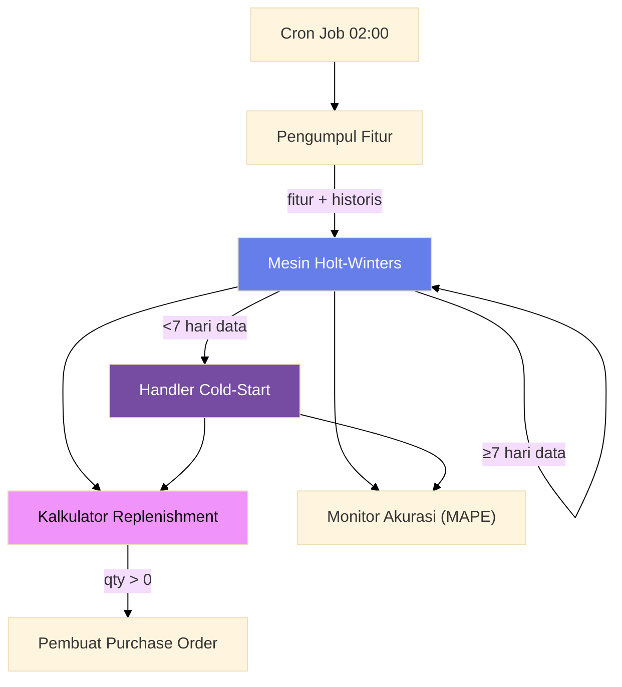

# Demand Forecasting & Replenishment

Mesin Holt-Winters triple exponential smoothing dengan handler cold-start Bayesian, kalkulator replenishment (reorder point + safety stock + FEFO), pengumpul fitur eksternal, dan monitor akurasi MAPE. Dirancang untuk q-commerce di mana permintaan sangat musiman dengan amplitudo multiplikatif.

## Arsitektur



## Komponen

### 1. Mesin Holt-Winters

Triple exponential smoothing multiplikatif menangkap level, tren, dan musiman.

| Parameter | Default | Deskripsi |
|-----------|---------|-----------|
| Alpha | 0.3 | Faktor smoothing level |
| Beta | 0.1 | Faktor smoothing tren |
| Gamma | 0.2 | Faktor smoothing musiman |
| SeasonLength | 7 | Pola harian (7 = mingguan) |

**Rumus:**

```
L_t = α · (Y_t / S_{t-s}) + (1-α) · (L_{t-1} + T_{t-1})   // Level
T_t = β · (L_t - L_{t-1}) + (1-β) · T_{t-1}                // Tren
S_t = γ · (Y_t / L_t) + (1-γ) · S_{t-s}                    // Musiman
F_{t+k} = (L_t + k · T_t) · S_{t+k-s}                      // Forecast
```

**Inisialisasi:** Level = rata-rata musim pertama. Tren = rata-rata perubahan antar periode. Musiman = setiap titik / level.

### 2. Handler Cold-Start (Bayesian Shrinkage)

Untuk SKU atau hub baru dengan data < 7 hari. Mengecilkan rata-rata sampel yang volatil ke rata-rata kategori yang stabil.

```
forecast = weight · sku_mean + (1 - weight) · category_mean
weight = n / (n + prior_strength)
```

**Tuning prior strength:**
- Dasar: 5.0
- Varians kategori > 100 → 3.0 (prior lebih lemah)
- Varians kategori < 10 → 10.0 (prior lebih kuat)

**Skor kepercayaan:** `min(0.3 + n · 0.1, 0.9)` — rentang dari 0.3 (1 titik) ke 0.9 (6+ titik).

| Titik Data | Metode | Kepercayaan |
|------------|--------|-------------|
| 0 | Rata-rata kategori | 0.3 |
| 1–6 | Bayesian shrinkage | 0.4–0.9 |
| ≥7 | Holt-Winters | 0.9+ |

**Contoh:** SKU "Es Krim Matcha Premium" diluncurkan 3 hari lalu dengan promo, rata-rata 200 unit/hari. Rata-rata kategori 50/hari. Dengan prior=5: weight = 3/(3+5) = 0.375. Forecast = 0.375×200 + 0.625×50 = **106 unit/hari** — jauh lebih realistis dari 200 mentah.

### 3. Kalkulator Replenishment

```
reorder_point = forecast_harian × lead_time_hari + safety_stock
safety_stock = z × sigma × √(lead_time_hari)
order_qty = max(0, reorder_point - on_hand - incoming + min_order_qty)
```

**Z-score berdasarkan service level:**

| Service Level | Z |
|---------------|---|
| 99% | 2.33 |
| 97.5% | 1.96 |
| 95% (default) | 1.65 |
| 90% | 1.28 |

**Prioritas days of cover:**
- < 1.0 hari → `high`
- 1.0–5.0 hari → `normal`
- > 5.0 hari → `low`

**FEFO (First Expired First Out):** Batch inventaris diurutkan berdasarkan `ExpiryDate` menaik. Kritis untuk barang segar (1–3 hari masa simpan). Tanpa FEFO, tingkat pemborosan naik 3–5x.

### 4. Pengumpul Fitur

Tiga goroutine konkuren mengumpulkan regressor eksternal:

| Sumber | Data | Penanganan Gagal |
|--------|------|-----------------|
| Weather API | Suhu, kelembaban, presipitasi, flag hujan | Log peringatan, nilai nol |
| Kalender Hari Libur | IsPublicHoliday, IsWeekend, RamadhanMode | Lookup cache |
| Jadwal Promo | HasPromo, PromoDiscountPct | Log peringatan, nilai nol |

**Deteksi musim:** Nov–Mar = hujan, Apr–Okt = kemarau, selainnya = transisi.

**Deteksi Ramadhan:** 20 Maret – 18 April (2026). Rentang tahunan yang disederhanakan.

### 5. Monitor Akurasi (MAPE)

```
APE = |forecast - aktual| / aktual × 100
```

- Rolling 30 hari MAPE harian per SKU-hub
- MAPE mingguan = rata-rata 7 hari terakhir
- MAPE bulanan = rata-rata 30 hari terakhir
- Ambang peringatan: 30%
- Ambang kritis: 50%
- Permintaan aktual nol dilewati (lost sale vs tidak ada permintaan — sengaja konservatif)

## Edge Cases

| Edge Case | Solusi |
|-----------|--------|
| **Stockout → data hilang** | Imputasi dari rata-rata jendela 48 jam pasca-stockout. Mencegah loop feedback under-ordering. |
| **Anomali pesanan besar** | Deteksi outlier Z-score sebelum dimasukkan ke model |
| **Kanibalisasi promo** | Promo SKU A dapat mengurangi permintaan SKU B. Perlu awareness lintas SKU. |
| **Stabilisasi hub baru** | Jendela cold-start 2–3 minggu. Re-tune setelah 14 hari. |
| **Kegagalan Weather API** | Fallback rata-rata klimatologi. Jangan blokir pipeline. |
| **Nol data kategori** | Default global + exponential backoff. Kepercayaan = 0.2. |

## API

| Metode | Path | Tujuan |
|--------|------|--------|
| POST | `/forecast/run` | Picu pipeline harian untuk hub IDs |
| GET | `/forecast/:sku/:hub_id` | Dapatkan hasil forecast terbaru |
| GET | `/forecast/accuracy/:sku/:hub_id` | Dapatkan statistik MAPE |
| POST | `/admin/features` | Seed fitur eksternal |

## Keputusan Teknis

| Keputusan | Alasan |
|-----------|--------|
| **Holt-Winters multiplikatif** | Permintaan q-commerce memiliki amplitudo musiman multiplikatif. Aditif akan under-forecast puncak. |
| **Bayesian shrinkage vs rata-rata mentah** | Mencegah forecast volatil untuk SKU baru dengan data sparse/noisy. |
| **Worker pool (20 konkurensi)** | 1.000 SKU × 50 hub = 50.000 pasangan. Sekuensial akan memakan waktu berjam-jam. |
| **FEFO untuk barang segar** | Masa simpan 1–3 hari membuat urutan kedaluwarsa kritis. Bubble sort cukup untuk ukuran batch. |
| **MAPE pada granularitas mingguan** | MAPE harian terlalu noisy. Smoothing mingguan memberikan peringatan dini sebelum stockout. |
| **Imputasi stockout sebelum training** | Tanpa imputasi: stockout → forecast turun → replenishment turun → makin stockout (loop feedback berbahaya). |
| **Regressor eksternal wajib** | Tanpa data cuaca, hari libur, dan promo, model buta terhadap pergeseran permintaan. |
| **Override parameter per SKU** | SKU berbeda memiliki karakteristik permintaan berbeda (kebutuhan pokok vs. mewah vs. musiman). |

## Source Code

[View on GitHub](https://github.com/faisalaffan/faisalaffan-design-system/blob/dev/services/forecasting-service/main.go)
