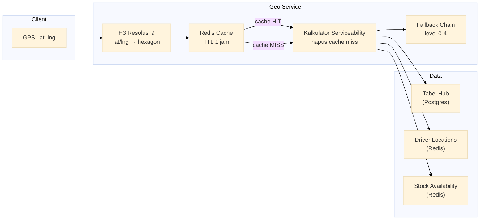

# Layanan Geo-Serviceability

Layanan geo-serviceability dengan indeks heksagon H3 resolusi 9, cache Redis TTL 1 jam, tie-breaking haversine (40% jarak + 40% stok + 20% rider), dan 5 tingkat fallback untuk menjamin jangkauan pengiriman.

Port **8092** | Paket `geo-service/`

---

## Arsitektur



## Komponen

### Indeks Heksagon H3 Resolusi 9

Setiap titik koordinat GPS dipetakan ke heksagon H3 resolusi 9 (area ~0,1 km2). Semua hub dalam heksagon yang sama dianggap melayani titik tersebut.

```go
import "github.com/uber/h3-go/v4"

func resolveHub(ctx context.Context, lat, lng float64) ([]Hub, error) {
    cell := h3.LatLngToCell(h3.LatLng{Lat: lat, Lng: lng}, 9)
    hubs, err := h3Index.Get(ctx, cell.String())
    if err != nil {
        return nil, fmt.Errorf("h3 lookup: %w", err)
    }
    return hubs, nil
}
```

### Tie-Breaking Haversine dengan Bobot

Ketika beberapa hub melayani heksagon yang sama, pemeringkat skor komposit menentukan hub terbaik:

```go
func scoreHub(hub Hub, lat, lng float64, stock int, riderCount int) float64 {
    distance := haversine(lat, lng, hub.Lat, hub.Lng)
    distScore := 1.0 - (distance / maxDistance)
    stockScore := math.Min(float64(stock)/float64(hub.Capacity), 1.0)
    riderScore := math.Min(float64(riderCount)/float64(hub.MaxRiders), 1.0)

    return 0.4*distScore + 0.4*stockScore + 0.2*riderScore
}
```

| Faktor | Bobot | Sumber Data |
|--------|-------|-------------|
| Jarak (haversine) | 40% | Koordinat hub vs. pelanggan |
| Ketersediaan stok | 40% | Status inventaris Redis |
| Ketersediaan rider | 20% | Jumlah driver aktif di area |

### 5 Tingkat Fallback

Jika hub tidak tersedia di resolusi 9, fallback melebar ke heksagon tetangga.

| Level | Radius Heksagon | Contoh Latency |
|-------|-----------------|----------------|
| 0 | Resolusi 9 langsung | 0 ms (cache) |
| 1 | Tetangga ring-1 resolusi 9 | ~10 ms |
| 2 | Tetangga ring-2 resolusi 9 | ~30 ms |
| 3 | Turun ke resolusi 8 | ~50 ms |
| 4 | Turun ke resolusi 6 (area kota) | ~100 ms |

```go
func fallbackSearch(ctx context.Context, cell h3.Cell, maxLevel int) ([]Hub, error) {
    for level := 0; level <= maxLevel; level++ {
        if level == 0 {
            hubs, err := resolveHub(ctx, cell)
            if len(hubs) > 0 {
                return hubs, nil
            }
            continue
        }
        if level <= 2 {
            neighbors := cell.GridRingDisc(level)
            for _, n := range neighbors {
                hubs, _ := h3Index.Get(ctx, n.String())
                if len(hubs) > 0 {
                    return hubs, nil
                }
            }
            continue
        }
        // level 3+: downgrade resolusi
        parent := cell.Parent(9 - (level - 2))
        hubs, _ := h3Index.Get(ctx, parent.String())
        if len(hubs) > 0 {
            return hubs, nil
        }
    }
    return nil, ErrNotServiceable
}
```

### Cache Redis TTL 1 Jam

Setiap hasil serviceability di-cache dengan kunci `geo:{hexagon}` dan TTL 3600 detik.

```
Cache hit  -> langsung kembalikan
Cache miss -> hitung dari Postgres, simpan di Redis
TTL 1 jam  -> stabilitas hub (hub jarang pindah)
```

## API Endpoints

| Method | Path | Deskripsi |
|--------|------|-------------|
| `GET` | `/serviceability?lat=&lng=` | Cek apakah lokasi dilayani, dapatkan hub terbaik |
| `POST` | `/admin/hubs` | Tambah atau perbarui data hub |

### GET /serviceability?lat=&lng=

```json
// Response 200
{
  "serviceable": true,
  "hub": {
    "id": "H1",
    "name": "Hub Central",
    "distance_km": 2.3,
    "score": 0.87,
    "fallback_level": 0
  },
  "alternatives": [
    {"hub_id": "H2", "distance_km": 3.1, "score": 0.72},
    {"hub_id": "H3", "distance_km": 4.5, "score": 0.61}
  ]
}

// Response 200 (tidak serviceable)
{"serviceable": false, "hub": null, "alternatives": []}
```

### POST /admin/hubs

```json
// Request
{
  "hub_id": "H4",
  "name": "Hub Timur",
  "lat": -6.2146,
  "lng": 106.8451,
  "capacity": 500,
  "max_riders": 30
}

// Response 201
{"status": "created", "hub_id": "H4"}
```

## Algoritma Kunci

| Algoritma | Penggunaan |
|-----------|------------|
| H3 hexagon encoding | Mapping lat/lng ke sel seragam resolusi 9 |
| Haversine distance | Perhitungan jarak geodesik antar koordinat |
| Weighted composite score | 40% jarak + 40% stok + 20% rider |
| Grid ring fallback | Ekspansi bertahap ke tetangga heksagon |
| Cache-aside Redis | Cache TTL dengan lazy population |

## Keputusan Teknis

- **H3 resolusi 9 menggantikan grid lon/lat**: Heksagon H3 memberikan cakupan seragam tanpa distorsi kutub. Resolusi 9 (~0,1 km2) memberikan granularitas yang cukup untuk serviceability perkotaan tanpa menghasilkan terlalu banyak sel.
- **5 tingkat fallback dengan degradasi eksplisit**: Daripada mengembalikan "tidak tersedia" langsung, layanan melebar secara progresif. Level 0-2 dalam resolusi 9 yang sama; level 3-4 turun resolusi untuk area dengan cakupan rendah. Batas 5 tingkat mencegah pengiriman terlalu jauh.
- **Bobot skor 40/40/20**: Jarak dan stok memiliki bobot sama karena keduanya sama-sama kritis untuk kelayakan pengiriman. Rider memiliki bobot lebih rendah karena jumlah rider bisa berubah cepat dan biasanya tidak menjadi bottleneck di area perkotaan.
- **Cache TTL 1 jam untuk stabilitas hub**: Hub berubah jarang (penambahan/pengurangan mingguan). TTL 1 jam mengurangi beban Postgres secara signifikan tanpa risiko data basi yang berarti.
- **Cache-aside, bukan write-through**: Hub ditulis langsung ke Postgres oleh admin. Cache Redis diisi secara lazy saat query pertama. Ini menghindari cache thundering herd pada startup dingin.
