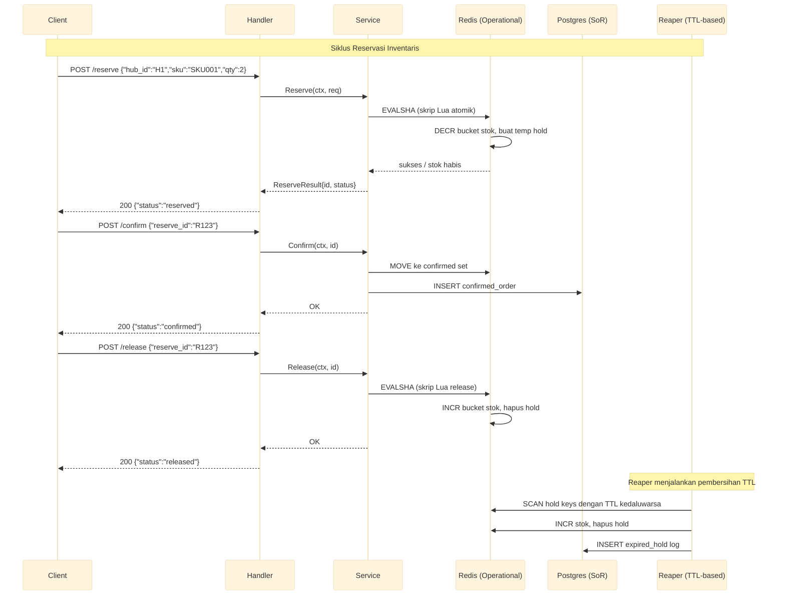

# Layanan Inventaris

Layanan inventaris real-time dengan skrip Lua Redis untuk reservasi atomik, penyimpanan ganda (Redis operasional + Postgres system-of-record), reaper berbasis TTL, dan partisi stok hingga 10 bucket per SKU panas.

Port **8091** | Paket `inventory-service/`

---

## Arsitektur



## Komponen

### Skrip Lua Redis untuk Reservasi Atomik

Semua mutasi stok terjadi dalam satu skrip Lua untuk menjamin atomisitas tanpa kondisi balapan.

```lua
-- reserve_stock.lua
local bucket_key = KEYS[1]        -- "stock:{hub}:{sku}:bucket:{n}"
local hold_key   = KEYS[2]        -- "hold:{reserve_id}"
local qty        = tonumber(ARGV[1])
local ttl        = tonumber(ARGV[2])

local stock = redis.call("GET", bucket_key)
if not stock or tonumber(stock) < qty then
    return {0, "insufficient stock"}
end

redis.call("DECRBY", bucket_key, qty)
redis.call("SETEX", hold_key, ttl, qty)
return {1, "reserved"}
```

### Penyimpanan Ganda (Dual-Store)

| Lapisan | Tujuan | Konsistensi |
|---------|--------|-------------|
| **Redis** | Operasional: reservasi cepat, pengecekan stok real-time | Eventual consistency. Data bisa hilang jika Redis crash sebelum replikasi |
| **Postgres** | System-of-record: konfirmasi order, log expired hold, audit trail | Strong consistency. Semua transaksi permanen dicatat di sini |

Alur kerja:
1. Reservasi hanya menyentuh Redis (cepat, atomik).
2. Konfirmasi memindahkan hold ke set confirmed di Redis *dan* menulis baris ke Postgres.
3. Release mengembalikan stok di Redis dan mencatat log di Postgres.

### Reaper Berbasis TTL

Reaper berjalan sebagai goroutine latar dengan interval konfigurabel. Tugasnya:

1. Memindai kunci hold yang TTL-nya kedaluwarsa.
2. Mengembalikan stok ke bucket Redis yang sesuai.
3. Mencatat entri `expired_hold` di Postgres untuk audit.

```go
func (r *Reaper) Run(ctx context.Context, interval time.Duration) {
    ticker := time.NewTicker(interval)
    defer ticker.Stop()
    for {
        select {
        case <-ctx.Done():
            return
        case <-ticker.C:
            r.reap()
        }
    }
}

func (r *Reaper) reap() {
    var cursor uint64
    for {
        keys, next, err := r.redis.Scan(ctx, cursor, "hold:*", 100).Result()
        // ... periksa TTL setiap kunci, kembalikan stok jika kedaluwarsa
        cursor = next
        if cursor == 0 {
            break
        }
    }
}
```

### Partisi Stok

SKU panas (high-throughput) dipartisi ke N bucket independen untuk mengurangi kontensi Redis.

```go
func bucketIndex(sku string, hubID string, n int) int {
    h := fnv.New32a()
    h.Write([]byte(hubID + ":" + sku))
    return int(h.Sum32()) % n
}
```

Setiap bucket adalah kunci Redis terpisah (`stock:{hub}:{sku}:bucket:{0..N-1}`). Reservasi memilih bucket dengan hash FNV-1a.

## API Endpoints

| Method | Path | Deskripsi |
|--------|------|-------------|
| `GET` | `/stock/:hub_id/:sku` | Mengecek stok tersedia untuk SKU di hub tertentu |
| `POST` | `/reserve` | Reservasi stok secara atomik |
| `POST` | `/release` | Membatalkan reservasi dan mengembalikan stok |
| `POST` | `/confirm` | Mengonfirmasi reservasi dan menulis ke SoR |

### POST /reserve

```json
// Request
{"hub_id": "H1", "sku": "SKU001", "qty": 2, "ttl_seconds": 300}

// Response 200
{"reserve_id": "hold:a1b2c3", "status": "reserved"}

// Response 409
{"error": "insufficient stock"}
```

### POST /confirm

```json
// Request
{"reserve_id": "hold:a1b2c3"}

// Response 200
{"status": "confirmed"}
```

### POST /release

```json
// Request
{"reserve_id": "hold:a1b2c3"}

// Response 200
{"status": "released"}
```

## Algoritma Kunci

| Algoritma | Penggunaan |
|-----------|------------|
| Reservasi Lua atomik | DECRBY + SETEX dalam satu skrip |
| Partisi bucket FNV-1a | Hash deterministik untuk pemilihan bucket |
| Reaper TTL-based | Scan + validasi TTL + rollback stok |
| Dual-write dengan konfirmasi | Redis opsional → Postgres system-of-record |

## Keputusan Teknis

- **Skrip Lua untuk atomisitas**: Redis `MULTI/EXEC` tidak cukup karena tidak bisa menggabungkan logika kondisional (periksa stok `DECRBY`). Skrip Lua menjamin operasi baca-komparasi-tulis sebagai satu unit tak-terputus.
- **Dual-store, bukan single-source**: Redis memberikan latensi sub-milidetik untuk reservasi, tetapi tidak memiliki durability yang kuat. Postgres menangani peran system-of-record tanpa memengaruhi jalur kritis. Ini trade-off yang disengaja antara kecepatan dan ketahanan.
- **TTL-based reaper menggantikan cron job**: Reaper in-process menghindari kompleksitas penjadwalan eksternal (cron, scheduler terdistribusi). Jika instance mati, TTL Redis sendiri yang membersihkan hold.
- **10 bucket per SKU panas**: Angka yang cukup untuk mendistribusikan kontensi di keyspace Redis sambil tetap menjaga kompleksitas manajemen bucket tetap rendah. Jumlah bucket bisa dikonfigurasi per SKU.
- **Hash FNV-1a untuk pemilihan bucket**: Algoritma hash cepat dan deterministik tanpa alokasi memori berarti. Tidak perlu consistent hashing karena jumlah bucket tetap per SKU.

## Source Code

[View on GitHub](https://github.com/faisalaffan/faisalaffan-design-system/blob/dev/services/inventory-service/main.go)
