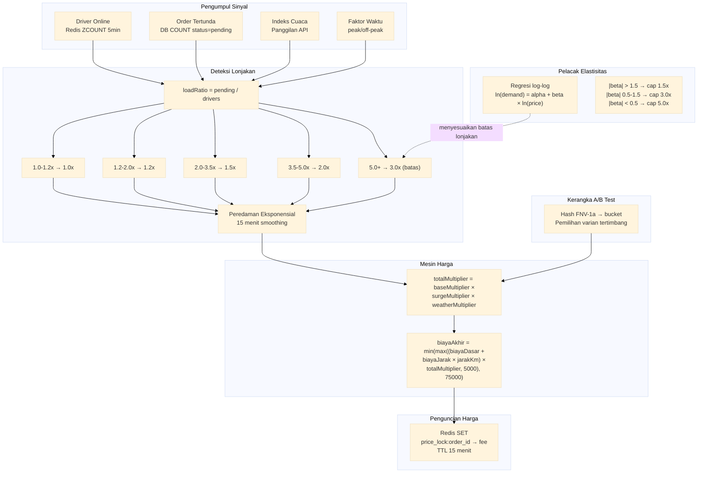

# Layanan Dynamic Pricing

Layanan dynamic pricing dengan pengumpul sinyal real-time, deteksi lonjakan berbasis ambang kaskade, penguncian harga (Redis 15 menit TTL), pelacak elastisitas (regresi log-log), dan kerangka A/B test (hash deterministik FNV-1a). Menghitung biaya antar final berdasarkan penawaran dan permintaan per area.

Port **8091** | Paket `pricing-service/`

---

## Arsitektur



## Pengumpul Sinyal

Pengumpul sinyal menjalankan lima goroutine konkuren untuk mengumpulkan kondisi pasar. Masing-masing memiliki batas waktu 5 detik. Jika sumber sinyal gagal (misalnya, API cuaca down), pengumpul mengembalikan nilai terakhir yang diketahui alih-alih menggagalkan seluruh permintaan.

| Sinyal | Sumber | Batas Waktu | Cadangan |
|--------|--------|-------------|----------|
| Driver online | Redis sorted set (ZCOUNT, 5 menit terakhir) | 5s | Hitungan terakhir diketahui |
| Order tertunda | Query DB (`WHERE status = 'pending'`) | 5s | Hitungan terakhir diketahui |
| Indeks cuaca | API cuaca eksternal | 5s | Netral (1.0) |
| Faktor waktu | Waktu lokal -> peak/off-peak | -- | Off-peak (1.0) |
| Elastisitas historis | Cache pelacak elastisitas | 5s | Batas default (3.0x) |

```go
type SignalCollector struct {
    driversOnline func(ctx context.Context) (int, error)
    pendingOrders func(ctx context.Context) (int, error)
    weatherIndex  func(ctx context.Context) (float64, error)
    timeFactor    func() float64
}

type MarketSignals struct {
    DriversOnline int     `json:"drivers_online"`
    PendingOrders int     `json:"pending_orders"`
    LoadRatio     float64 `json:"load_ratio"`
    Weather       float64 `json:"weather_multiplier"`
    TimeFactor    float64 `json:"time_factor"`
    Timestamp     time.Time `json:"timestamp"`
}

func (s *Service) collectSignals(ctx context.Context, areaID string) MarketSignals {
    ctx, cancel := context.WithTimeout(ctx, 5*time.Second)
    defer cancel()

    type result struct {
        drivers int
        pending int
        weather float64
    }

    ch := make(chan result, 1)
    go func() {
        d, _ := s.signalCollector.driversOnline(ctx)
        p, _ := s.signalCollector.pendingOrders(ctx)
        w, _ := s.signalCollector.weatherIndex(ctx)
        ch <- result{d, p, w}
    }()

    var r result
    select {
    case r = <-ch:
    case <-ctx.Done():
        // fallback ke nilai terakhir
        r = s.lastSignals[areaID]
    }

    loadRatio := 0.0
    if r.drivers > 0 {
        loadRatio = float64(r.pending) / float64(r.drivers)
    }

    signals := MarketSignals{
        DriversOnline: r.drivers,
        PendingOrders: r.pending,
        LoadRatio:     loadRatio,
        Weather:       r.weather,
        TimeFactor:    s.signalCollector.timeFactor(),
        Timestamp:     time.Now(),
    }

    s.lastSignals[areaID] = signals
    return signals
}
```

## Deteksi Lonjakan

Deteksi lonjakan menerjemahkan rasio beban (order tertunda per driver) menjadi pengali dinamis menggunakan ambang kaskade.

### Ambang Kaskade

| Rentang Load Ratio | Pengali Lonjakan | Kondisi Bisnis |
|--------------------|------------------|----------------|
| 0.0 - 1.0          | 1.0x             | Normal |
| 1.0 - 1.2          | 1.0x             | Meningkat -- belum lonjakan |
| 1.2 - 2.0          | 1.2x             | Lonjakan ringan |
| 2.0 - 3.5          | 1.5x             | Lonjakan sedang |
| 3.5 - 5.0          | 2.0x             | Lonjakan berat |
| 5.0+               | 3.0x (batas)     | Lonjakan kritis |

```go
func surgeMultiplier(loadRatio float64) float64 {
    switch {
    case loadRatio >= 5.0:
        return 3.0
    case loadRatio >= 3.5:
        return 2.0
    case loadRatio >= 2.0:
        return 1.5
    case loadRatio >= 1.2:
        return 1.2
    default:
        return 1.0
    }
}
```

### Peredaman Eksponensial

Pengali lonjakan mentah dapat berosilasi cepat di antara ambang batas. Rata-rata bergerak eksponensial 15 menit menghaluskan transisi:

```go
type SurgeTracker struct {
    mu       sync.RWMutex
    smoothed map[string]float64 // areaID -> pengali yang dihaluskan
    alpha    float64            // faktor penghalusan (0.3)
}

func (st *SurgeTracker) Update(areaID string, raw float64, interval time.Duration) float64 {
    st.mu.Lock()
    defer st.mu.Unlock()

    prev, exists := st.smoothed[areaID]
    if !exists {
        st.smoothed[areaID] = raw
        return raw
    }

    // Peredaman eksponensial: st = alpha * raw + (1 - alpha) * prev
    decay := math.Exp(-interval.Minutes() / 15.0)
    alpha := 1.0 - decay
    smoothed := alpha*raw + (1-alpha)*prev

    // Batas keras 3.0x
    if smoothed > 3.0 {
        smoothed = 3.0
    }

    st.smoothed[areaID] = smoothed
    return smoothed
}
```

Konstanta peluruhan adalah `exp(-t / 15)` di mana `t` adalah interval dalam menit sejak pembaruan terakhir. Pada 15 menit, bobot nilai sebelumnya turun ke ~37%; pada 30 menit, ke ~14%. Ini mencegah lonjakan tiba-tiba mencapai pelanggan sambil tetap merespons perubahan permintaan yang berkelanjutan.

## Mesin Harga

Mesin harga menggabungkan semua pengali ke dalam rumus biaya antar final:

```
totalMultiplier = baseMultiplier × surgeMultiplier × weatherMultiplier
biayaAkhir      = min(max((biayaDasar + biayaJarak × jarakKm) × totalMultiplier, 5000), 75000)
```

Di mana:
- **baseMultiplier** = 1.0 (dapat dikonfigurasi per area; misalnya, daerah terpencil mulai dari 1.2)
- **surgeMultiplier** = keluaran dari deteksi lonjakan (dihaluskan, 1.0 - 3.0)
- **weatherMultiplier** = dari indeks cuaca (1.0 normal, hingga 1.5 cuaca ekstrem)
- **biayaDasar** = 5000 IDR (biaya dasar yang dapat dikonfigurasi)
- **biayaJarak** = 2000 IDR per km (tarif jarak yang dapat dikonfigurasi)
- **Batas akhir**: 5.0x total pengali dari dasar (diterapkan di akhir). Batas spesifik area, dipelajari dari Pelacak Elastisitas.

Pengali total dibatasi maksimal 5.0x terlepas dari komponen individual:

```go
func (s *Service) computeFinalFee(baseFee, distanceKm int32, multipliers Multipliers) int32 {
    totalMul := multipliers.Base * multipliers.Surge * multipliers.Weather
    if totalMul > s.maxTotalMultiplier(areaID) {
        totalMul = s.maxTotalMultiplier(areaID)
    }

    raw := float64(baseFee + distanceFee*distanceKm) * totalMul
    final := int32(math.Round(raw))

    if final < 5000 {
        final = 5000
    }
    if final > 75000 {
        final = 75000
    }
    return final
}
```

## Penguncian Harga

Setelah dihitung, harga dikunci di Redis dengan TTL 15 menit. Ini memastikan biaya yang ditunjukkan saat pemesanan sesuai dengan biaya yang dibebankan saat pembayaran, bahkan jika kondisi lonjakan berubah di antaranya.

```go
func (s *Service) lockPrice(ctx context.Context, orderID string, fee int32) error {
    key := "price_lock:" + orderID
    err := s.rdb.Set(ctx, key, fee, 15*time.Minute).Err()
    if err != nil {
        // fail-open: catat error tapi izinkan order berjalan
        log.Printf("penguncian harga gagal untuk %s: %v", orderID, err)
        return nil
    }
    return nil
}
```

### Perilaku Fail-Open

Jika Redis tidak terjangkau, fungsi penguncian mencatat error dan mengembalikan `nil`. Order berjalan dengan biaya yang telah dihitung. Ini adalah trade-off yang disengaja: ketersediaan di atas konsistensi untuk penetapan harga. Tanpa ini, gangguan Redis akan memblokir semua order.

### Verifikasi Pembayaran

Saat pembayaran, layanan checkout mengambil harga yang terkunci:

```go
func (s *Service) getLockedPrice(ctx context.Context, orderID string) (int32, bool) {
    key := "price_lock:" + orderID
    fee, err := s.rdb.Get(ctx, key).Int()
    if err != nil {
        if errors.Is(err, redis.Nil) {
            // Kunci kedaluwarsa -- fallback ke perhitungan real-time
            return s.computePrice(ctx, orderID), false
        }
        // Error Redis -- fail-open: fallback ke real-time
        return s.computePrice(ctx, orderID), false
    }
    return int32(fee), true
}
```

Jika kunci telah kedaluwarsa (TTL terlampaui), layanan kembali ke perhitungan harga baru. Nilai boolean menunjukkan apakah harga dikunci (true) atau baru dihitung (false).

## Pelacak Elastisitas

Pelacak elastisitas mempelajari seberapa sensitif permintaan setiap area terhadap perubahan harga. Ini memberi umpan balik untuk menyesuaikan batas lonjakan per area.

### Regresi Log-Log

Pelacak memelihara jendela geser observasi (harga, permintaan) dan menyesuaikan model regresi log-log:

```
ln(permintaan) = alpha + beta x ln(harga)
```

Kemiringan `beta` adalah elastisitas harga permintaan:
- **|beta| > 1.5**: Sangat elastis -- pelanggan sensitif terhadap harga. Batas lonjakan ditetapkan ke 1.5x untuk menghindari menghalangi order.
- **|beta| 0.5 - 1.5**: Elastisitas sedang. Batas lonjakan ditetapkan ke 3.0x.
- **|beta| < 0.5**: Inelastis -- pelanggan toleran terhadap perubahan harga. Batas lonjakan ditetapkan ke 5.0x.

```go
type ElasticityTracker struct {
    observations map[string][]PriceDemand  // areaID -> jendela geser
    windowSize   int                       // 500 observasi
    caps         map[string]float64        // areaID -> pengali total maks
}

func (et *ElasticityTracker) Update(areaID string, price int32, demand int) {
    et.observations[areaID] = append(et.observations[areaID], PriceDemand{
        Price:   float64(price),
        Demand:  float64(demand),
        Time:    time.Now(),
    })

    // Potong jendela geser
    if len(et.observations[areaID]) > et.windowSize {
        et.observations[areaID] = et.observations[areaID][1:]
    }

    // Pasang ulang regresi
    if len(et.observations[areaID]) >= 30 {
        beta := et.fitLogLog(areaID)
        et.caps[areaID] = elasticityToCap(beta)
    }
}

func (et *ElasticityTracker) fitLogLog(areaID string) float64 {
    obs := et.observations[areaID]
    n := float64(len(obs))

    var sumX, sumY, sumXY, sumX2 float64
    for _, o := range obs {
        lnP := math.Log(o.Price)
        lnD := math.Log(o.Demand)
        sumX += lnP
        sumY += lnD
        sumXY += lnP * lnD
        sumX2 += lnP * lnP
    }

    // beta = (n*sumXY - sumX*sumY) / (n*sumX2 - sumX*sumX)
    beta := (n*sumXY - sumX*sumY) / (n*sumX2 - sumX*sumX)
    return beta
}

func elasticityToCap(beta float64) float64 {
    absBeta := math.Abs(beta)
    switch {
    case absBeta > 1.5:
        return 1.5 // Sangat elastis -- jaga harga tetap rendah
    case absBeta > 0.5:
        return 3.0 // Elastisitas sedang
    default:
        return 5.0 // Inelastis -- bisa naikkan lonjakan lebih tinggi
    }
}
```

Jendela geser menyimpan 500 observasi terakhir, dan regresi dipasang ulang hanya jika setidaknya 30 titik data tersedia.

## Kerangka A/B Test

Layanan pricing mendukung A/B testing dari formula harga yang berbeda. Setiap permintaan di-bucket secara deterministik menggunakan hash FNV-1a, memastikan pengguna yang sama selalu melihat varian yang sama.

```go
func abBucket(userID string, variants []ABVariant) *ABVariant {
    // Hash FNV-1a dari userID
    h := fnv.New32a()
    h.Write([]byte(userID))
    hash := h.Sum32()

    // Bobot total
    totalWeight := 0
    for _, v := range variants {
        totalWeight += v.Weight
    }

    // Pemilihan tertimbang
    bucket := int(hash % uint32(totalWeight))
    cumulative := 0
    for _, v := range variants {
        cumulative += v.Weight
        if bucket < cumulative {
            return &v
        }
    }

    return &variants[len(variants)-1]
}
```

| Parameter | Deskripsi |
|-----------|-----------|
| Pembuatan bucket | Hash FNV-1a 32-bit dari `userID` modulo bobot total |
| Bobot varian | Persentase yang dapat dikonfigurasi (misalnya, kontrol=80, perlakuan=20) |
| Deterministik | Pengguna yang sama -> varian yang sama setiap saat |
| Evaluasi | Dicatat dengan ID order untuk analisis hilir |

## API Endpoints

| Method | Path | Deskripsi |
|--------|------|-------------|
| `POST` | `/api/v1/delivery-fee` | Hitung biaya antar dengan lonjakan dinamis |
| `GET` | `/api/v1/locked-price?order_id=` | Ambil harga terkunci untuk verifikasi pembayaran |
| `GET` | `/admin/signals/:area_id` | Lihat sinyal pasar saat ini (admin) |

### POST /api/v1/delivery-fee

```json
// Request
{
  "user_id": "usr_abc",
  "area_id": "area_jkt_01",
  "base_fee": 5000,
  "distance_km": 3.2
}

// Response 200
{
  "data": {
    "order_id": "ord_xyz",
    "final_fee": 13520,
    "multipliers": {
      "base": 1.0,
      "surge": 1.5,
      "weather": 1.0,
      "total": 1.5
    },
    "signals": {
      "drivers_online": 42,
      "pending_orders": 78,
      "load_ratio": 1.86,
      "weather": 1.0,
      "time_factor": 1.2
    },
    "price_locked": true,
    "lock_expires_at": "2026-06-22T10:45:00Z"
  }
}
```

### GET /api/v1/locked-price

```json
// Request
GET /api/v1/locked-price?order_id=ord_xyz

// Response 200
{
  "data": {
    "order_id": "ord_xyz",
    "locked_fee": 13520,
    "locked_at": "2026-06-22T10:30:00Z",
    "locked": true
  }
}

// Response 200 (kunci kedaluwarsa)
{
  "data": {
    "order_id": "ord_xyz",
    "locked_fee": 14780,
    "locked": false
  }
}
```

### GET /admin/signals/:area_id

```json
// Response 200
{
  "data": {
    "area_id": "area_jkt_01",
    "signals": {
      "drivers_online": 42,
      "pending_orders": 78,
      "load_ratio": 1.86,
      "weather": 1.0,
      "time_factor": 1.2
    },
    "current_surge": 1.5,
    "elasticity_beta": -1.2,
    "surge_cap": 3.0,
    "updated_at": "2026-06-22T10:30:00Z"
  }
}
```

## Algoritma Kunci

| Algoritma | Penggunaan |
|-----------|------------|
| Concurrent signal collector | 5 goroutine, 5s timeout, nilai cadangan jika gagal |
| Cascading thresholds | loadRatio 1.0-1.2x, 2.0-1.5x, 3.5-2.0x, 5.0-3.0x |
| Peredaman eksponensial | EMA 15 menit, konstanta peluruhan exp(-t/15), batas 3.0x |
| Penguncian harga Redis | SET dengan TTL 15 menit, fail-open, fallback real-time |
| Regresi log-log | OLS pada ln(price) dan ln(demand), jendela geser 500 observasi |
| Hash deterministik FNV-1a | Pembuatan bucket A/B dengan pemilihan varian tertimbang |

## Keputusan Teknis

- **Fail-open pada penguncian harga**: Redis tidak tersedia seharusnya tidak memblokir order. Fungsi penguncian mencatat error dan mengembalikan nil, memungkinkan order berjalan dengan biaya yang dihitung. Verifikasi pembayaran kembali ke perhitungan real-time jika kunci hilang. Ini memprioritaskan ketersediaan di atas konsistensi ketat untuk penetapan harga.
- **Ambang kaskade, bukan fungsi kontinu**: Tingkat lonjakan diskrit (1.0x, 1.2x, 1.5x, 2.0x, 3.0x) lebih mudah dikomunikasikan kepada driver dan pelanggan daripada fungsi kontinu. Setiap tingkat sesuai dengan kondisi pasar yang dapat diamati (lonjakan ringan, sedang, berat, kritis), membuat perilaku sistem transparan dan dapat diaudit.
- **Peredaman eksponensial, bukan perubahan langkah**: Tanpa peredaman, pengali lonjakan dapat berosilasi di antara tingkat saat rasio beban berada di dekat batas. Peluruhan eksponensial dengan waktu paruh 15 menit meredam osilasi sambil tetap melacak pergeseran permintaan yang berkelanjutan. Respons asimetris (naik cepat, turun lambat) sesuai dengan ekspektasi bisnis: lonjakan harus aktif saat permintaan kilat tetapi meluruh secara bertahap untuk menghindari kejutan harga saat normalisasi.
- **Regresi elastisitas log-log**: Elastisitas secara inheren adalah hubungan multiplikatif -- perubahan harga 10% menyebabkan perubahan permintaan X%. Transformasi log-log melinearisasi hubungan ini, membuat regresi kuadrat terkecil biasa (OLS) valid. Minimum 30 observasi mencegah regeksi palsu pada data yang tidak mencukupi.
- **Pembuatan bucket deterministik FNV-1a**: Konsistensi A/B test sangat penting -- memindahkan pengguna antara kontrol dan perlakuan di tengah order akan membatalkan pengujian. FNV-1a cepat (dipercepat perangkat keras pada CPU modern), deterministik, dan menghasilkan distribusi seragam yang cocok untuk pembuatan bucket.
- **Batas keras pada pengali total (5.0x)**: Mencegah skenario lonjakan ekstrem menciptakan biaya yang sangat tinggi. Batas disesuaikan per area berdasarkan elastisitas: area sensitif harga mendapatkan batas lebih rendah (1.5x), sementara pasar inelastis dapat melonjak lebih tinggi (5.0x). Ini adalah jaring pengaman bisnis, bukan batas teknis.
- **Bawah biaya minimum (5000 IDR) dan langit-langit (75000 IDR)**: Memastikan setiap pengiriman menutupi biaya marjinal platform (bawah) sambil mempertahankan kepercayaan pelanggan bahwa biaya tidak akan melebihi maksimum yang wajar (langit-langit). Kedua nilai dapat dikonfigurasi per area.

## Source Code

[View on GitHub](https://github.com/faisalaffan/faisalaffan-design-system/blob/dev/services/pricing-service/main.go)
