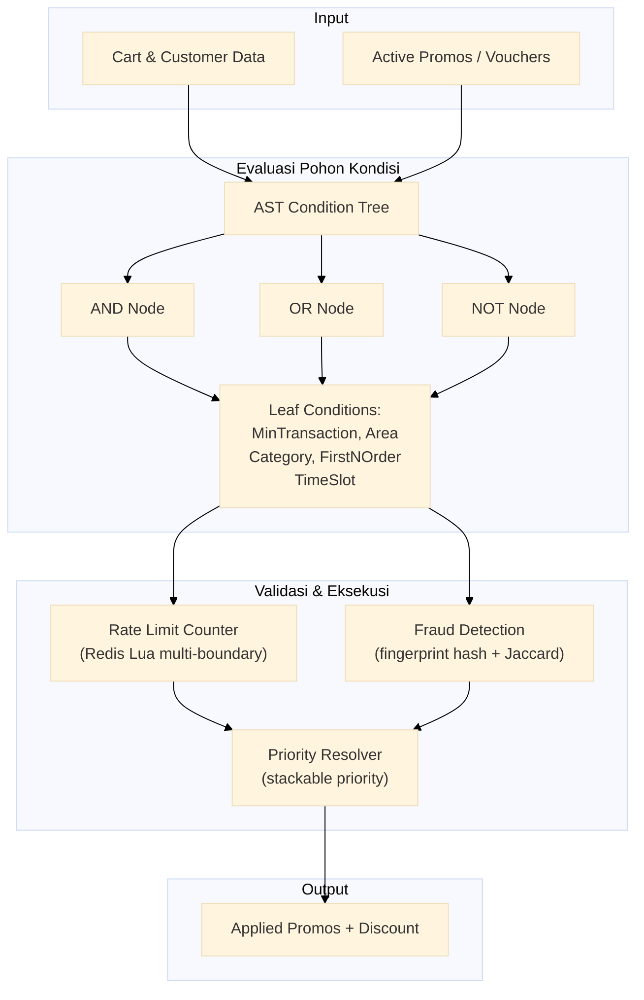

# Mesin Promo

Mesin promo/voucher dengan pohon kondisi AST komposabel (AND/OR/NOT, MinTransaction/Area/Category/FirstNOrder/TimeSlot), counter atomik Redis Lua multi-batas, resolusi stackable prioritas, dan deteksi kecurangan berbasis hash sidik jari serta similaritas Jaccard.

Port **8095** | Paket `promo-engine/`

---

## Arsitektur



## Komponen

### Pohon Kondisi AST Komposabel

Setiap aturan promo direpresentasikan sebagai pohon AST dengan node komposabel.

```go
type ConditionType string

const (
    AND            ConditionType = "AND"
    OR             ConditionType = "OR"
    NOT            ConditionType = "NOT"
    MinTransaction ConditionType = "MinTransaction"
    Area           ConditionType = "Area"
    Category       ConditionType = "Category"
    FirstNOrder    ConditionType = "FirstNOrder"
    TimeSlot       ConditionType = "TimeSlot"
)

type ConditionNode struct {
    Type     ConditionType  `json:"type"`
    Operator string         `json:"operator,omitempty"` // gt, gte, eq, in, between
    Value    interface{}    `json:"value,omitempty"`
    Children []ConditionNode `json:"children,omitempty"`
}
```

Evaluasi rekursif pohon kondisi:

```go
func (e *Engine) evaluate(ctx context.Context, node ConditionNode, cart Cart) (bool, error) {
    switch node.Type {
    case AND:
        for _, child := range node.Children {
            ok, err := e.evaluate(ctx, child, cart)
            if err != nil || !ok {
                return false, err
            }
        }
        return true, nil

    case OR:
        for _, child := range node.Children {
            ok, err := e.evaluate(ctx, child, cart)
            if ok || err != nil {
                return ok, err
            }
        }
        return false, nil

    case NOT:
        if len(node.Children) != 1 {
            return false, ErrInvalidAST
        }
        ok, err := e.evaluate(ctx, node.Children[0], cart)
        return !ok, err

    case MinTransaction:
        return cart.Total >= node.Value.(float64), nil

    case Area:
        return contains(node.Value.([]string), cart.HubID), nil

    case FirstNOrder:
        return e.isFirstNOrder(ctx, cart.CustomerID, node.Value.(int))

    case TimeSlot:
        now := time.Now()
        slot := node.Value.(TimeRange)
        return now.After(slot.Start) && now.Before(slot.End), nil
    }
}
```

### Counter Atomik Redis Lua Multi-Batas

Counter penggunaan promo dengan beberapa batas (per user, global, periode waktu) dalam satu skrip Lua atomik.

```lua
-- promo_counter.lua
local user_key     = KEYS[1]  -- "promo:usage:{promo_id}:user:{user_id}"
local global_key   = KEYS[2]  -- "promo:usage:{promo_id}:global"
local user_limit   = tonumber(ARGV[1])
local global_limit = tonumber(ARGV[2])
local ttl          = tonumber(ARGV[3])

-- cek batas pengguna
local user_count = redis.call("GET", user_key)
if user_count and tonumber(user_count) >= user_limit then
    return {0, "user limit reached"}
end

-- cek batas global
local global_count = redis.call("GET", global_key)
if global_count and tonumber(global_count) >= global_limit then
    return {0, "global limit reached"}
end

-- increment kedua counter
redis.call("INCR", user_key)
redis.call("INCR", global_key)
redis.call("EXPIRE", user_key, ttl)
redis.call("EXPIRE", global_key, ttl)

return {1, "ok"}
```

### Resolusi Stackable Prioritas

Ketika beberapa promo berlaku, resolver menerapkannya dalam urutan prioritas.

```go
type Promo struct {
    ID           string  `json:"id"`
    Priority     int     `json:"priority"`     // lebih kecil = lebih tinggi
    Stackable    bool    `json:"stackable"`     // bisa digabung?
    DiscountType string  `json:"discount_type"` // percentage, fixed
    DiscountValue float64 `json:"discount_value"`
}

func resolvePromos(promos []Promo) []AppliedPromo {
    // urutkan berdasarkan prioritas
    sort.Slice(promos, func(i, j int) bool {
        return promos[i].Priority < promos[j].Priority
    })

    var result []AppliedPromo
    for _, p := range promos {
        if !p.Stackable && len(result) > 0 {
            continue // non-stackable: skip jika sudah ada promo lain
        }
        result = append(result, AppliedPromo{
            PromoID: p.ID,
            Discount: calculateDiscount(p),
        })
    }
    return result
}
```

### Deteksi Kecurangan

Dua lapisan deteksi: hash sidik jari untuk identifikasi perangkat dan similaritas Jaccard untuk pola pesanan.

```go
type FraudDetector struct {
    redis *redis.Client
}

// Fingerprint hash: deteksi akun/grup yang sama
func (f *FraudDetector) checkFingerprint(ctx context.Context, fingerprint string, promoID string) bool {
    key := fmt.Sprintf("fraud:fp:%s:%s", promoID, fingerprint)
    count, _ := f.redis.Incr(ctx, key).Result()
    f.redis.Expire(ctx, key, 24*time.Hour)
    return count <= 3 // max 3 penggunaan per fingerprint per hari
}

// Similaritas Jaccard: deteksi pola pesanan yang mirip
func (f *FraudDetector) jaccardSimilarity(a, b []string) float64 {
    setA := make(map[string]bool)
    for _, item := range a {
        setA[item] = true
    }
    intersection := 0
    for _, item := range b {
        if setA[item] {
            intersection++
        }
    }
    union := len(a) + len(b) - intersection
    if union == 0 {
        return 0
    }
    return float64(intersection) / float64(union)
}
```

## API Endpoints

| Method | Path | Deskripsi |
|--------|------|-------------|
| `POST` | `/validate` | Validasi promo/voucher terhadap keranjang |
| `POST` | `/apply` | Terapkan promo ke keranjang dan hitung diskon |
| `POST` | `/admin/rules` | Tambah atau perbarui aturan promo |

### POST /validate

```json
// Request
{
  "promo_id": "PROMO001",
  "cart": {
    "total": 100000,
    "hub_id": "H1",
    "items": [
      {"sku": "SKU001", "category": "elektronik", "price": 50000, "qty": 2}
    ]
  },
  "customer": {
    "id": "CUST001",
    "device_fingerprint": "fp123",
    "order_count": 3
  }
}

// Response 200
{
  "valid": true,
  "conditions_met": ["MinTransaction", "TimeSlot"],
  "discount_summary": {"type": "percentage", "value": 10}
}
```

### POST /apply

```json
// Request
(sama seperti validate)

// Response 200
{
  "applied": [
    {"promo_id": "PROMO001", "discount": 10000, "priority": 1, "stackable": false}
  ],
  "total_before": 100000,
  "total_discount": 10000,
  "total_after": 90000
}
```

### POST /admin/rules

```json
// Request
{
  "promo_id": "PROMO003",
  "name": "Diskon Elektronik Akhir Pekan",
  "priority": 2,
  "stackable": true,
  "discount": {"type": "percentage", "value": 15},
  "condition_tree": {
    "type": "AND",
    "children": [
      {"type": "MinTransaction", "operator": "gte", "value": 50000},
      {"type": "Category", "operator": "in", "value": ["elektronik"]},
      {"type": "TimeSlot", "value": {"start": "2025-01-18T00:00:00Z", "end": "2025-01-19T23:59:59Z"}}
    ]
  },
  "usage_limits": {
    "per_user": 1,
    "global": 1000,
    "ttl_seconds": 86400
  }
}

// Response 201
{"status": "created", "promo_id": "PROMO003"}
```

## Algoritma Kunci

| Algoritma | Penggunaan |
|-----------|------------|
| AST condition tree | Evaluasi rekursif kondisi promo komposabel |
| Lua multi-boundary counter | Increment atomik dengan pengecekan batas ganda |
| Priority-based stacking | Urut dan saring promo berdasarkan prioritas + stackable |
| Fingerprint hash | Deteksi penggunaan promo berlebih per perangkat |
| Jaccard similarity | Deteksi pola keranjang yang mencurigakan (sama/sangat mirip) |

## Keputusan Teknis

- **AST komposabel (AND/OR/NOT) vs. rule string**: AST memberikan fleksibilitas maksimal untuk kombinasi kondisi tanpa parsing string berbahaya. Aturan bisnis bisa dikomposisi secara deklaratif dalam JSON, bukan ditulis dalam DSL kustom.
- **Counter Lua multi-batas dalam satu skrip**: Dua round-trip Redis (satu untuk cek user, satu untuk cek global) memiliki kondisi balapan. Skrip Lua menggabungkan cek dan increment dalam satu operasi atomik. Ini menjamin bahwa batas tidak pernah terlampaui meskipun di bawah konkurensi tinggi.
- **Prioritas numerik untuk stackable resolution**: Prioritas rendah = lebih tinggi, mengikuti konvensi Unix nice value. Promo dengan prioritas lebih tinggi (angka lebih kecil) diproses lebih dulu. Promo non-stackable memblokir promo lain setelahnya.
- **Dua lapisan deteksi kecurangan**: Fingerprint hash mendeteksi penyalahgunaan perangkat (cepat, murah). Similaritas Jaccard mendeteksi pola mencurigakan yang lebih halus (lebih mahal, dijalankan batch). Bersama-sama memberikan cakupan deteksi yang luas.
- **Pohon kondisi disimpan sebagai JSON di Postgres**: Struktur AST bisa langsung diserialisasi ke JSON dan disimpan di kolom `condition_tree`. Tidak perlu tabel kondisi normalisasi. JSONB di Postgres memungkinkan indeks dan query jika diperlukan.
