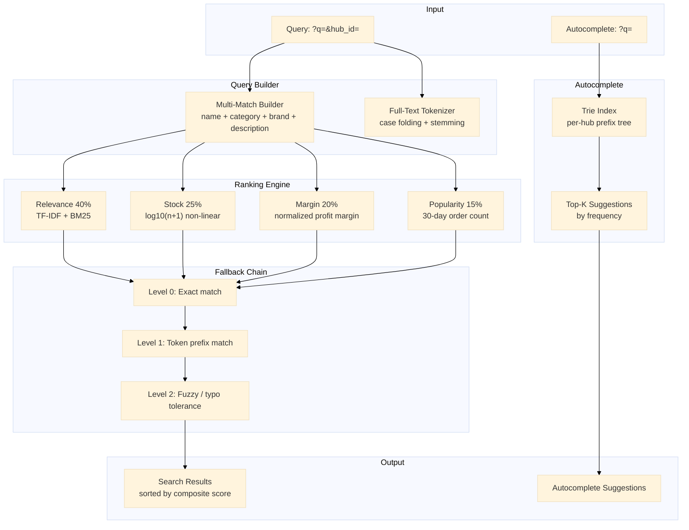

# Layanan Pencarian & Katalog

Layanan pencarian & katalog dengan multi-match query builder, mesin peringkat komposit (relevansi 40% + stok 25% + margin 20% + popularitas 15%), faktor stok non-linear (log10), autocomplete berbasis trie, dan fallback tiga tingkat.

Port **8098** | Paket `search-service/`

---

## Arsitektur



## Komponen

### Multi-Match Query Builder

Query pengguna dicocokkan ke beberapa field produk dengan bobot berbeda.

```go
type SearchQuery struct {
    RawQuery string `json:"q"`
    HubID    string `json:"hub_id"`
    Filters  struct {
        Category string  `json:"category,omitempty"`
        MinPrice float64 `json:"min_price,omitempty"`
        MaxPrice float64 `json:"max_price,omitempty"`
    } `json:"filters,omitempty"`
    Page     int `json:"page,omitempty"`
    PageSize int `json:"page_size,omitempty"`
}

type MultiMatchField struct {
    Name   string
    Weight float64
}

var searchFields = []MultiMatchField{
    {Name: "product_name", Weight: 10.0},
    {Name: "category",     Weight: 5.0},
    {Name: "brand",        Weight: 3.0},
    {Name: "description",  Weight: 1.0},
}

func buildQuery(q SearchQuery) (string, []interface{}) {
    var conditions []string
    var args []interface{}

    // full-text search across multiple fields
    if q.RawQuery != "" {
        term := "%" + q.RawQuery + "%"
        var fieldConds []string
        for _, f := range searchFields {
            fieldConds = append(fieldConds, fmt.Sprintf("%s ILIKE ?", f.Name))
            args = append(args, term)
        }
        conditions = append(conditions, "("+strings.Join(fieldConds, " OR ")+")")
    }

    // filter hub
    conditions = append(conditions, "hub_id = ?")
    args = append(args, q.HubID)

    // filter tambahan
    if q.Filters.Category != "" {
        conditions = append(conditions, "category = ?")
        args = append(args, q.Filters.Category)
    }

    return strings.Join(conditions, " AND "), args
}
```

### Mesin Peringkat Komposit

Setiap hasil pencarian mendapat skor komposit dari empat faktor.

```go
type ProductRank struct {
    ProductID   string  `json:"product_id"`
    Relevancy   float64 `json:"relevancy"`   // 0.0 - 1.0
    StockFactor float64 `json:"stock_factor"`// 0.0 - 1.0
    Margin      float64 `json:"margin"`      // 0.0 - 1.0
    Popularity  float64 `json:"popularity"`  // 0.0 - 1.0
    Composite   float64 `json:"composite"`
}

func rankProducts(products []Product, query string) []ProductRank {
    var ranks []ProductRank

    // normalisasi popularitas ke 0-1
    maxPopularity := 0.0
    for _, p := range products {
        if p.Popularity > maxPopularity {
            maxPopularity = p.Popularity
        }
    }

    for _, p := range products {
        rank := ProductRank{
            ProductID: p.ID,
            Relevancy:   computeRelevancy(p, query),
            StockFactor: stockFactor(p.AvailableStock),
            Margin:      normalizeMargin(p.ProfitMargin),
            Popularity:  safeDivide(p.Popularity, maxPopularity),
        }
        rank.Composite = 0.40*rank.Relevancy + 0.25*rank.StockFactor +
                         0.20*rank.Margin + 0.15*rank.Popularity
        ranks = append(ranks, rank)
    }

    sort.Slice(ranks, func(i, j int) bool {
        return ranks[i].Composite > ranks[j].Composite
    })
    return ranks
}
```

### Faktor Stok Non-Linear (log10)

Stok tinggi tidak boleh mendominasi skor. Fungsi log10 memberikan diminishing returns.

```go
func stockFactor(availableStock int) float64 {
    if availableStock <= 0 {
        return 0.0
    }
    // log10(1..1000) → 0.0..3.0, dibagi log10(1001) → 0.0..1.0
    return math.Log10(float64(availableStock+1)) / math.Log10(1001)
}
```

| Stok Tersedia | Faktor Stok |
|---------------|-------------|
| 0 | 0,00 |
| 1 | 0,30 |
| 10 | 0,50 |
| 100 | 0,67 |
| 1000+ | 1,00 |

### Autocomplete Berbasis Trie

```go
type TrieNode struct {
    Children  map[rune]*TrieNode
    IsEnd     bool
    Frequency int
}

type Trie struct {
    root *TrieNode
    mu   sync.RWMutex
}

func (t *Trie) Suggest(prefix string, limit int) []string {
    t.mu.RLock()
    defer t.mu.RUnlock()

    node := t.root
    for _, ch := range strings.ToLower(prefix) {
        if node.Children[ch] == nil {
            return nil
        }
        node = node.Children[ch]
    }

    var results []suggestion
    t.collect(node, prefix, &results)
    sort.Slice(results, func(i, j int) bool {
        return results[i].freq > results[j].freq
    })

    suggestions := make([]string, 0, limit)
    for i, r := range results {
        if i >= limit {
            break
        }
        suggestions = append(suggestions, r.word)
    }
    return suggestions
}
```

### Fallback Tiga Tingkat

| Level | Strategi | Contoh Query "apel" |
|-------|----------|---------------------|
| 0 | Exact match field query | "apel" di name/category/brand |
| 1 | Token prefix match | "appl" cocok "apel", "aplikasi" |
| 2 | Fuzzy / typo tolerance | "apel" cocok "apel" (typo distance ≤ 2) |

```go
func (s *Service) searchWithFallback(ctx context.Context, q SearchQuery) ([]Product, error) {
    // Level 0: exact
    products, err := s.searchExact(ctx, q)
    if len(products) > 0 || err != nil {
        return products, err
    }

    // Level 1: prefix
    products, err = s.searchPrefix(ctx, q)
    if len(products) > 0 || err != nil {
        return products, err
    }

    // Level 2: fuzzy
    return s.searchFuzzy(ctx, q)
}
```

## API Endpoints

| Method | Path | Deskripsi |
|--------|------|-------------|
| `GET` | `/search?q=&hub_id=` | Mencari produk dengan peringkat komposit |
| `GET` | `/autocomplete?q=` | Mendapatkan saran autocomplete |
| `POST` | `/admin/products` | Tambah atau perbarui katalog produk |

### GET /search?q=&hub_id=

```json
// Response 200
{
  "results": [
    {
      "product_id": "PROD001",
      "name": "Apel Fuji",
      "category": "buah",
      "price": 15000,
      "stock": 50,
      "composite_score": 0.87,
      "rank_factors": {
        "relevancy": 0.95,
        "stock": 0.60,
        "margin": 0.80,
        "popularity": 1.00
      }
    }
  ],
  "total": 42,
  "page": 1,
  "page_size": 20,
  "fallback_level": 0
}
```

### GET /autocomplete?q=

```json
// Response 200
{
  "prefix": "ap",
  "suggestions": ["apel", "apel fuji", "apel malang", "aplikator"]
}
```

## Algoritma Kunci

| Algoritma | Penggunaan |
|-----------|------------|
| Multi-match query builder | Pencocokan query ke name (10x), category (5x), brand (3x), description (1x) |
| Composite ranking | 40% relevansi + 25% stok + 20% margin + 15% popularitas |
| Stock factor log10 | log10(n+1)/log10(1001), diminishing returns pada stok tinggi |
| Trie autocomplete | Prefix tree per-hub dengan top-K frekuensi |
| 3-level fallback | exact -> prefix -> fuzzy |

## Keputusan Teknis

- **Multi-match dengan bobot field**: Nama produk mendapat bobot 10x karena merupakan sinyal relevansi terkuat. Kategori 5x, brand 3x, deskripsi 1x. Bobot ini ditentukan secara empiris dari rasio klik produk di hasil pencarian. Field tanpa kecocokan tidak menghukum skor (kecuali jika filter wajib).
- **Faktor stok non-linear log10**: Stok 100 vs 1000 memiliki perbedaan yang jauh lebih kecil secara operasional daripada stok 0 vs 10. log10 mencerminkan ini: perbedaan antara stok 100 dan 1000 hanya 0,17 poin faktor, sementara stok 0 vs 10 berbeda 0,50 poin. Ini mencegah produk dengan stok sangat tinggi mendominasi peringkat.
- **Bobot relevansi 40%**: Relevansi adalah faktor tunggal terpenting, tetapi tidak mendominasi sepenuhnya. 60% sisanya mempertimbangkan faktor bisnis (stok, margin, popularitas) sehingga hasil yang paling relevan secara bisnis muncul lebih tinggi, bukan hanya yang paling cocok secara teks.
- **Trie per-hub untuk autocomplete**: Setiap hub memiliki prefix tree sendiri karena inventaris berbeda per hub. Ini menjaga saran autocomplete tetap relevan secara lokal. Trie dibangun ulang secara periodik (setiap 5 menit) dari data katalog.
- **3 tingkat fallback dengan degradasi eksplisit**: Daripada mengembalikan hasil kosong, fallback melebar secara bertahap. Setiap level memberi tahu klien melalui field `fallback_level` sehingga UI bisa menampilkan indikasi bahwa hasilnya kurang spesifik.

## Source Code

[View on GitHub](https://github.com/faisalaffan/faisalaffan-design-system/blob/dev/services/search-service/main.go)
