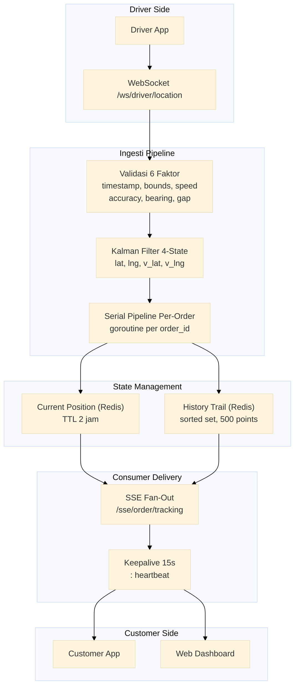

# Layanan Pelacakan Real-Time

Layanan pelacakan real-time dengan ingesti GPS driver via WebSocket, validasi 6 faktor, filter Kalman 4-state adaptif, pipeline serial per-order, dan fan-out SSE (text/event-stream, keepalive 15 detik).

Port **8099** | Paket `tracking-service/`

---

## Arsitektur



## Komponen

### Ingesti GPS Driver via WebSocket

Driver mengirimkan lokasi GPS melalui koneksi WebSocket yang persisten.

```go
type GPSPoint struct {
    DriverID  string    `json:"driver_id"`
    OrderID   string    `json:"order_id"`
    Lat       float64   `json:"lat"`
    Lng       float64   `json:"lng"`
    Speed     float64   `json:"speed"`     // km/jam
    Bearing   float64   `json:"bearing"`   // derajat
    Accuracy  float64   `json:"accuracy"`  // meter
    Timestamp time.Time `json:"timestamp"`
}
```

### Validasi 6 Faktor

Setiap titik GPS melewati 6 pemeriksaan validasi sebelum diproses.

```go
func validate(gps GPSPoint) error {
    checks := []struct {
        name string
        fn   func() bool
    }{
        {"timestamp_tolerance", func() bool {
            return !gps.Timestamp.IsZero() && time.Since(gps.Timestamp) < 30*time.Second
        }},
        {"lat_lng_bounds", func() bool {
            return gps.Lat >= -90 && gps.Lat <= 90 && gps.Lng >= -180 && gps.Lng <= 180
        }},
        {"speed_sanity", func() bool {
            return gps.Speed >= 0 && gps.Speed <= 120 // km/jam
        }},
        {"accuracy_threshold", func() bool {
            return gps.Accuracy > 0 && gps.Accuracy <= 100 // meter
        }},
        {"bearing_range", func() bool {
            return gps.Bearing >= 0 && gps.Bearing <= 360
        }},
        {"minimum_gap", func() bool {
            // minimal 1 detik antar titik dari driver yang sama
            return true // diperiksa di pipeline serial
        }},
    }

    for _, c := range checks {
        if !c.fn() {
            return fmt.Errorf("validation failed: %s", c.name)
        }
    }
    return nil
}
```

| Faktor | Rentang Valid | Alasan |
|--------|---------------|--------|
| Timestamp tolerance | < 30 detik dari now | Mencegah data basi |
| Lat/Lng bounds | -90..90, -180..180 | Koordinat geografis valid |
| Speed sanity | 0 - 120 km/jam | Kecepatan realistik kendaraan |
| Accuracy threshold | 1 - 100 meter | Akurasi GPS minimal |
| Bearing range | 0 - 360 derajat | Arah valid |
| Minimum gap | >= 1 detik | Mencegah duplikat |

### Filter Kalman 4-State Adaptif

Filter Kalman 4-state (latitude, longitude, velocity_lat, velocity_lng) mengurangi noise GPS dan memprediksi posisi.

```go
type KalmanFilter struct {
    // State vector: [lat, lng, v_lat, v_lng]
    state    [4]float64
    // Covariance matrix
    cov      [4][4]float64
    // Process noise (adaptive)
    q        float64
    // Measurement noise
    r        float64
}

func (kf *KalmanFilter) Predict(dt float64) {
    // State transition matrix F
    // [1 0 dt 0]
    // [0 1 0 dt]
    // [0 0 1  0]
    // [0 0 0  1]

    kf.state[0] += kf.state[2] * dt // lat += v_lat * dt
    kf.state[1] += kf.state[3] * dt // lng += v_lng * dt
    // update covariance: P = F * P * F^T + Q
    kf.updateCovariance(dt)
}

func (kf *KalmanFilter) Update(lat, lng float64) {
    // Innovation: z - H * x
    innovLat := lat - kf.state[0]
    innovLng := lng - kf.state[1]

    // Kalman gain K = P * H^T * (H * P * H^T + R)^-1
    k := kf.computeGain()

    // State update: x = x + K * z
    kf.state[0] += k[0] * innovLat
    kf.state[1] += k[1] * innovLng

    // Adaptive Q: tingkatkan noise jika inovasi besar
    innovation := math.Sqrt(innovLat*innovLat + innovLng*innovLng)
    if innovation > 0.001 {
        kf.q *= 1.1 // tingkatkan process noise
    } else {
        kf.q *= 0.9 // turunkan
    }
}
```

### Pipeline Serial Per-Order

Setiap order memiliki pipeline goroutine sendiri yang menjamin pemrosesan titik GPS berurutan.

```go
type TrackingPipeline struct {
    mu       sync.Mutex
    pipelines map[string]chan GPSPoint
}

func (tp *TrackingPipeline) GetOrCreate(orderID string) chan<- GPSPoint {
    tp.mu.Lock()
    defer tp.mu.Unlock()

    if ch, ok := tp.pipelines[orderID]; ok {
        return ch
    }

    ch := make(chan GPSPoint, 100)
    tp.pipelines[orderID] = ch

    go tp.process(orderID, ch)
    return ch
}

func (tp *TrackingPipeline) process(orderID string, ch <-chan GPSPoint) {
    kf := NewKalmanFilter()
    for point := range ch {
        kf.Predict(point.Timestamp.Sub(prevTimestamp).Seconds())
        kf.Update(point.Lat, point.Lng)
        // simpan posisi yang sudah difilter
        tp.savePosition(orderID, kf.state)
    }
}
```

### Fan-Out SSE

Pelanggan menerima pembaruan lokasi real-time melalui Server-Sent Events.

```go
type SSEManager struct {
    mu       sync.RWMutex
    clients  map[string]map[chan string]bool // orderID -> set of channels
}

func (m *SSEManager) Subscribe(orderID string) <-chan string {
    ch := make(chan string, 10)
    m.mu.Lock()
    if m.clients[orderID] == nil {
        m.clients[orderID] = make(map[chan string]bool)
    }
    m.clients[orderID][ch] = true
    m.mu.Unlock()
    return ch
}

func (m *SSEManager) Broadcast(orderID string, data []byte) {
    m.mu.RLock()
    clients := m.clients[orderID]
    m.mu.RUnlock()
    for ch := range clients {
        select {
        case ch <- string(data):
        default:
            // client slow, lewati
        }
    }
}
```

Format SSE:

```
event: location
data: {"lat": -6.2146, "lng": 106.8451, "speed": 30, "bearing": 180, "timestamp": "2025-01-15T10:30:00Z"}

event: status
data: {"status": "arrived"}

: heartbeat (setiap 15 detik)
```

## API Endpoints

| Method | Path | Deskripsi |
|--------|------|-------------|
| `GET` | `/ws/driver/location?driver_id=&order_id=` | WebSocket untuk ingesti GPS driver |
| `GET` | `/sse/order/tracking?order_id=` | SSE untuk pelacakan pelanggan |

### GET /ws/driver/location

```
WebSocket Request:
ws://localhost:8099/ws/driver/location?driver_id=DRV001&order_id=ORD123

Message (driver -> server):
{"lat": -6.2146, "lng": 106.8451, "speed": 30, "bearing": 180, "accuracy": 5, "timestamp": "2025-01-15T10:30:00Z"}

Response (server -> driver):
{"status": "ok", "point_id": "pt_123"}
```

### GET /sse/order/tracking

```
SSE Stream:
GET /sse/order/tracking?order_id=ORD123

event: location
data: {"lat": -6.2146, "lng": 106.8451, "speed": 30, "bearing": 180, "timestamp": "2025-01-15T10:30:05Z"}

event: location
data: {"lat": -6.2150, "lng": 106.8455, "speed": 28, "bearing": 175, "timestamp": "2025-01-15T10:30:10Z"}

: heartbeat
```

## Algoritma Kunci

| Algoritma | Penggunaan |
|-----------|------------|
| 6-factor GPS validation | Filter titik GPS sebelum pemrosesan |
| Kalman filter 4-state | Prediksi + smoothing posisi driver |
| Adaptive process noise | Menyesuaikan Q berdasarkan magnitudo inovasi |
| Serial pipeline goroutine | Per-order channel menjamin urutan pemrosesan |
| SSE fan-out | Broadcast event ke semua pelanggan per order |

## Keputusan Teknis

- **6 faktor validasi, bukan 2-3**: GPS smartphone bisa menghasilkan data anomali (loncatan koordinat, timestamp masa depan, kecepatan tidak masuk akal). Enam lapisan validasi menjamin bahwa hanya data yang masuk akal yang masuk ke filter Kalman. Data anomali dibuang, bukan diperbaiki, untuk menghindari kesalahan kumulatif.
- **Filter Kalman 4-state menggantikan moving average**: Moving average sederhana memiliki lag yang signifikan. Kalman filter 4-state (posisi + kecepatan) memberikan estimasi yang lebih halus dan dapat memprediksi posisi di antara titik GPS. Adaptive Q menangani perubahan pola gerakan (berhenti, belok, akselerasi).
- **Pipeline serial per-order**: GPS driver untuk order yang sama HARUS diproses berurutan. Pipeline berbasis channel per-order menjamin urutan tanpa blokade antar-order yang berbeda.
- **SSE, bukan WebSocket**: Pelanggan hanya perlu menerima pembaruan satu arah. SSE memanfaatkan HTTP/1.1 streaming, lebih sederhana daripada WebSocket, dan memiliki native browser API `EventSource` dengan reconnection otomatis.
- **Keepalive 15 detik**: SSE bisa terputus oleh proxy/idle connection timeout tanpa deteksi. Keepalive `: heartbeat` setiap 15 detik menjaga koneksi tetap hidup dan memberikan deteksi pemutusan yang cepat (dalam 2 interval heartbeat).

## Source Code

[View on GitHub](https://github.com/faisalaffan/faisalaffan-design-system/blob/dev/services/tracking-service/main.go)
